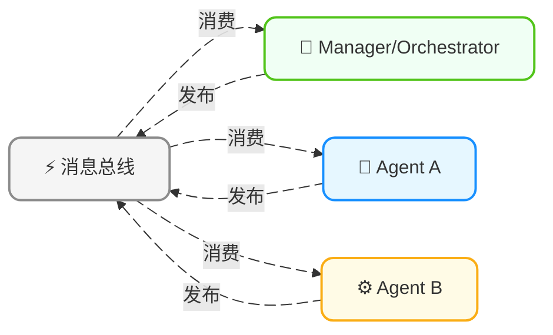

<!-- Copyright © 2026 Techunder (Guanhua Liu) | All Rights Reserved | https://techunder.tech | Email: techunder@163.com -->
<div class="page-title">多Agent架构</div>
<div class="page-info">
   <span class="original-tag">原创</span>
  发布时间：2026-08-07 | 更新时间：2026-08-07
</div>


多Agent架构就是联合多个Agent共同完成一个任务。

> [!NOTE]
> 多Agent中的每个Agent本身依然可以跑Agent‑Loop（ReAct)。

# 为什么需要多Agent架构

多Agent相对单Agent的核心优势，分来两个角度展开：

- 克服LLM的能力上限角度：
    1. **专业化分工，注意力集中**，工具集、技能集最小化，system prompt极简。
    2. **上下文隔离**，每个子Agent拥有独立上下文，只输出中间结果，避免上下文窗口爆炸和污染。
    3. **互相纠偏**，可以引入独立的review/judge Agent做校验、辩论、纠错，主动发现幻觉与错误，避免单Agent的幻觉跑偏。

- 工程落地角度：
    1. **并行执行，缩短处理时长**。
    2. **容错与故障隔离**，单Agent崩溃只需重跑该子任务。
    3. **权限最小化控制**，可以给每个Agent需必要的最小权限。
    4. **模块化可扩展**，多Agent就像微服务架构，新Agent的加入不影响整体流程，能力扩展友好。

> [!NOTE]
> **幻觉**、**注意力分散**、**上下文窗口大小**是LLM的能力上限，Agent也需要像人类一样，团队协作才能完成复杂的任务。

# 多Agent协作范式

- **委派模式**（层级）：Manager Agent拆解任务，下发Worker Agent 执行，最后汇总结果；
- **辩论模式**（对抗）：对立Agent输出不同观点，judge仲裁，降低事实幻觉；
- **黑板模式**（共创）：多个Agent基于共享状态迭代创作；

## 辩论模式（MAD）

（Multi‑Agent Debate）

多个独立Agent带着不同立场/视角互相质疑、反驳、补漏洞，把隐藏假设、逻辑错误、幻觉暴露出来，最后收敛出更可靠结论。

> [!TIP]
> 单Agent自我反思很难推翻自己，会自我辩护、自圆其说。

**拓扑**：大多是带Judge/Orchestrator的星形拓扑；辩论选手之间可以点对点Mesh对话，但全程受调度Agent管控，极少完全无监管纯网状。

### 应用举例
 
**1. 正反辩论**

（Pro‑Con 正反方）
 
**角色**：正方Agent、反方Agent、仲裁Agent

**流程**：
1. **开篇**：双方各自输出开篇立论；
2. **辩论**：多轮互相反驳，针对对方论据找漏洞；
3. **总结**：仲裁Agent看完整辩论记录，综合双方输出最终答案，不是简单选输赢，而是整合有效信息。

**示例**：

技术选型：是否在业务中引入Rust重构核心服务

1. 正方Agent（Round‑1）：主张引入Rust；论据：内存安全、高性能、减少程序崩溃。
2. 反方Agent（Round‑1）：反对大规模引入 Rust；论据：人才缺口大，不能利用现有Python/Go生态积累，会导致开发效率下降，且带来迁移风险。
3. 正方反驳（Round‑2）：可以局部核心链路小范围试点，不是全量重写。
4. 反方反驳（Round‑2）：试点同样带来两套技术栈维护成本，运维复杂度上升。
5. 仲裁Agent：不简单选 “用 / 不用”，输出结论：局部热点模块试点Rust，其余维持Go，配套人才培养计划，取得性能与开发效率的平衡。

> 注意：Agent 被 prompt 锁死立场。哪怕正方内心知道对方部分有理，它的任务依然是捍卫本方立场；求真交给 Judge，避免和稀泥（huò xī ní）。

**2. 魔鬼代言人**

（Devil’s Advocate）

只有一个主Agent输出方案，另一个Agent专门挑刺，故意唱反调，不一定持有自己完整替代方案，核心目标就是找缺陷、风险、隐藏假设。

> [!TIP]
> 不需要对称正反，适合方案评审、代码审计、风险评估。

**角色**：主Agent、魔鬼代言人Agent、仲裁Agent

**流程**：
1. **开篇**：主Agent给出观点与方案；
2. **辩论**：魔鬼代言人Agent发起攻击；主Agent根据攻击不断优化方案；
3. **总结**：仲裁Agent观看整个过程，当魔鬼代言人没有特别的攻击点时，叫停辩论，以主Agent的最终优化方案作为输出。

**示例**：

系统架构方案评审

1. 架构Agent输出：微服务拆分方案、接口定义、扩容策略。
2. 魔鬼代言人Agent：专门攻击这套方案：
    - “你没有考虑分布式事务失败场景？”
    - “峰值下服务之间调用雪崩风险没有评估？”
    - “如果平滑升级部署？回滚方案是什么？”
    - “运维复杂度上升，现有团队运维能力是否匹配？”
3. 架构Agent根据批评迭代修改方案。
4. 仲裁Agent：视辩论的情况叫停辩论，输出加固后的版本。

> 对比普通单Agent自我Review：自己写的方案自己很难狠下心挑致命漏洞；独立魔鬼代言人Agent可以无情攻击。

### 实现架构



Judge 负责下发任务、控制最大辩论轮次、收集全部对话 transcript、检测是否达成收敛、触发终止、输出最终结果。  
选手 Agent 之间可以直接点对点发消息（Mesh），但所有消息副本必须给到 Judge，不能完全脱离管控。  

通信消息格式：
```json
{
  "task_id":"xxx", 
  "message_id": "uuid",
  "sender": "agent_a",
  "receiver": ["agent_b", "manager"], // 接收方，可以单播/多播
  "message_type": "task_assign | result | feedback | question",
  "content": "语义文本 / 结构化payload",
  "timestamp": 1345544333
}
```

### 落地痛点

- **和稀泥**：Agent 不愿意激烈对抗，总说 “双方都有道理”，辩论变成互相吹捧，没有真正交锋。
    - 解决：prompt 强制锁死立场；给辩手下指令，必须找对方论据具体漏洞，禁止模糊折中表述。

- **乒乓死循环**：反复重复相同论点，没有新信息产生。
    - 解决：硬约束最大轮次；检测语义相似度，如果两轮观点相似度很高，强制终止辩论；Judge 主动截断。

- **幻觉传染**：两个 Agent 一起产生幻觉，互相引用对方的错误作为论据，越辩越错。
    - 解决：引入独立 Fact‑Checker 事实核查 Agent，允许调用搜索工具校验双方提出的事实主张。
