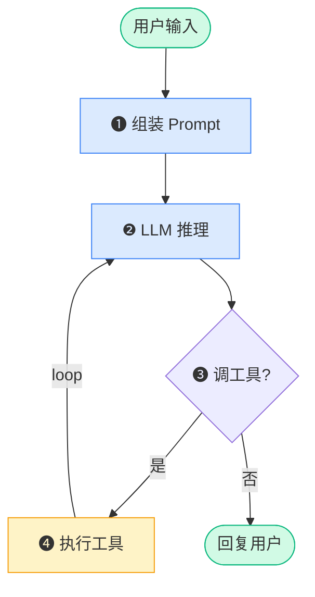

<!-- Copyright © 2026 Techunder (Guanhua Liu) | All Rights Reserved | https://techunder.tech | Email: techunder@163.com -->
<div class="page-title">AI Agent ReAct</div>
<div class="page-info">
   <span class="original-tag">原创</span>
  发布时间：2026-07-06 | 更新时间：2026-07-06
</div>


所谓 ReAct 就是以 **Reason-Act Loop**（推理-行动循环）的方式让 LLM 自我驱动工作，直到 LLM 认为可以输出最终结果。

Act（行动）通常是通过调用工具（tool/function）与外部系统互动，通过获取信息理解环境，通过作用于外部从而改变环境。

# 功能示意图


其中 ❷  → ❸  → ❹  → ❷  的循环可以发生多次，直至 LLM 不再产生 Tool Calling 意图或设定的最大循环次数到达。

# 最小 ReAct Loop

本 Demo code 演示最小化版本的 ReAct Loop。

ReAct Loop 需要先注册 Tools，然后交给 LLM 做推理（Reason）。Loop 的核心代码在 `Agent.run` 函数。

{}
完整 `Python` 代码：
```python
# pip install openai

# need to configure an openai API compatible model with the following ENV variables:
#    export OPENAI_BASE_URL=<BASE_URL>
#    export OPENAI_API_KEY=<API_KEY>

import json
import os
import sys
import time
import logging
from typing import Callable
from openai import OpenAI

# == LOGS ======================================================================

# configure logging
logging.basicConfig(level=logging.INFO, format="%(asctime)s [%(levelname)s] %(name)s: %(message)s")
logging.getLogger("httpcore").setLevel(logging.WARNING)
logging.getLogger("httpx").setLevel(logging.WARNING)
logger = logging.getLogger("ReAct")

def print_msg(msg):
    logger.debug("============ object start")
    if hasattr(msg, "to_dict"):
        logger.debug(json.dumps(msg.to_dict(), indent=2, ensure_ascii=False))
    else:
        logger.debug(json.dumps(msg, indent=2, ensure_ascii=False))
    logger.debug("------------- object end")


# == TOOLS =====================================================================

def get_weather(location: str) -> str:
    """Get weather of a location (demo with fixed data)."""
    weather_data = {
        "北京": "小雨，气温 15-22°C，湿度 80%。",
        "上海": "晴，气温 22-28°C，湿度 50%。",
        "广州": "多云，气温 25-30°C，湿度 70%。",
        "佛山": "多云，气温 24-30°C，湿度 69%，微风。",
    }
    return weather_data.get(location, f"{location}天气：数据暂缺，请稍后再试。")


get_weather_schema = {
        "type": "function",
        "function": {
            "name": get_weather.__name__,
            "description": "获取指定城市的天气，用户需要先提供具体位置。",
        "parameters": {
            "type": "object",
            "properties": {
                "location": {
                    "type": "string",
                    "description": "城市名称，例如广州",
                }
            },
            "required": ["location"]
        },
    }
}


def get_location() -> str:
    """Get user's current location (demo with fixed data)."""
    location_data = {
        "ip": "127.0.0.1",
        "city": "广州",
        "region": "广东省",
        "country": "中国",
    }
    return json.dumps(location_data, ensure_ascii=False)


get_location_schema = {
        "type": "function",
        "function": {
            "name": get_location.__name__,
            "description": "获取用户的当前位置，例如所在城市与地区。",
        "parameters": {
            "type": "object",
            "properties": {},
            "required": []
        },
    }
}

LOCAL_TOOLS = [
    (get_weather.__name__, get_weather, get_weather_schema),
    (get_location.__name__, get_location, get_location_schema),
]

class Tool:
    def __init__(self, name: str, fn: Callable, schema: dict):
        self.name = name
        self.fn = fn
        self.schema = schema

    def execute(self, args):
        return self.fn(**args)

# == AGGENT ====================================================================

class Agent:
    def __init__(self, max_iterations, model_name):
        self.tools: dict[str, Tool] = {}
        self.max_iterations = max_iterations
        self.model_name = model_name
        self.client = OpenAI()
        self.messages: list = [
            {"role": "system", "content": "You are a helpful assistant."}
        ]

    def register(self, name, fn, schema):
        self.tools[name] = Tool(name, fn, schema)
        logger.info("registered tool: %s", name)

    def execute_tool_call(self, tc_name, args):
        return self.tools[tc_name].execute(args)

    def tool_schemas(self):
        return [t.schema for t in self.tools.values()]

    def run(self, user_input):
        self.messages.append({"role": "user", "content": user_input})
        print_msg(self.messages[-1])
        logger.info("USER> %s", user_input)

        t0 = time.perf_counter()
        try:
            for _ in range(self.max_iterations):
                response = self.client.chat.completions.create(
                    model=self.model_name,
                    messages=self.messages,
                    tools=self.tool_schemas(),
                    extra_body={"reasoning_split": True}, # split the reasoning and content when return
                )
                msg = response.choices[0].message
                self.messages.append(msg)
                print_msg(self.messages[-1])

                if not msg.tool_calls:
                    # 无工具调用意图，正常回复用户，结束
                    logger.info("ASSISTANT> %s", msg.content)
                    break
                for tc in msg.tool_calls:
                    # 检测到 LLM 的工具调用意图，发起工具调用
                    logger.info("ASSISTANT> 【调用工具】: %s, 【参数】: %s", tc.function.name, tc.function.arguments)

                    tc_result = self.execute_tool_call(tc.function.name, json.loads(tc.function.arguments))
                    logger.info("TOOL> %s", tc_result)

                    # 向 LLM 返回工具调用原始结果
                    msg = {"role": "tool", "tool_call_id": tc.id, "content": str(tc_result)}
                    self.messages.append(msg)
                    print_msg(self.messages[-1])
        finally:
            logger.info("react loop finished in %.3f s", (time.perf_counter() - t0))

# == MAIN ======================================================================

if __name__ == "__main__":
    # initialize agent
    agent = Agent(max_iterations=30, model_name="MiniMax-M3")

    # register tools
    for name, fn, schema in LOCAL_TOOLS:
        agent.register(name, fn, schema)

    # react loop
    user_input = "今天的天气如何？"
    agent.run(user_input)
```

运行日志：
```text
2026-07-05 15:36:14,402 [INFO] ReAct: registered tool: get_weather
2026-07-05 15:36:14,402 [INFO] ReAct: registered tool: get_location
2026-07-05 15:36:14,402 [INFO] ReAct: USER> 今天的天气如何？
2026-07-05 15:36:18,879 [INFO] ReAct: ASSISTANT> 【调用工具】: get_location, 【参数】: {}
2026-07-05 15:36:18,880 [INFO] ReAct: TOOL> {"ip": "127.0.0.1", "city": "广州", "region": "广东省", "country": "中国"}
2026-07-05 15:36:20,693 [INFO] ReAct: ASSISTANT> 【调用工具】: get_weather, 【参数】: {"location":"广州"}
2026-07-05 15:36:20,693 [INFO] ReAct: TOOL> 多云，气温 25-30°C，湿度 70%。
2026-07-05 15:36:24,333 [INFO] ReAct: ASSISTANT> 根据您所在的位置（广州），今天的天气情况如下：

🌤️ **广州今日天气**
- **天气状况**：多云
- **气温**：25-30°C
- **湿度**：70%

温馨提示：今天天气较为闷热，外出建议穿着轻薄透气的衣物，并注意补充水分。如果需要长时间户外活动，可以随身携带一把伞以备不时之需。😊

需要我帮您查询其他城市的天气吗？
2026-07-05 15:36:24,333 [INFO] ReAct: react loop finished in 9.931 s
```
{}

# ReAct Loop + MCP

[**MCP**](/docs/ai-agent-intro/2-agent/#tools--mcp) 提供标准化的外部 Tool 接口，当 ReAct Loop 配置上 MCP Server，犹如为大脑接入了手脚，可以直接操控物理世界。

{}
MCP Server 配置文件 `config.json` 示列：
```json
{
  "mcp_servers": [
    {
      "name": "mcp-server",
      "url": "https://example.com/mcp/",
      "headers": {
        "<HEADER_NAME>": "<HEADER_VALUE>"
      },
      "prefix": "butler__"
    }
  ]
}
```

完整 `Python` 代码：
```python
# pip install openai

# need to configure an openai API compatible model with the following ENV variables:
#    export OPENAI_BASE_URL=<BASE_URL>
#    export OPENAI_API_KEY=<API_KEY>

import json
import os
import sys
import time
import logging
from typing import Any, Callable
import httpx
from openai import OpenAI

# == LOGS ======================================================================

# configure logging (level=DEBUG|INFO)
logging.basicConfig(level=logging.INFO, format="%(asctime)s [%(levelname)s] %(name)s: %(message)s")
logging.getLogger("httpcore").setLevel(logging.WARNING)
logging.getLogger("httpx").setLevel(logging.WARNING)
logging.getLogger("openai._base_client").setLevel(logging.WARNING)
logger = logging.getLogger("ReAct+MCP")

def print_msg(msg):
    logger.debug("============ object start")
    if hasattr(msg, "to_dict"):
        logger.debug(json.dumps(msg.to_dict(), indent=2, ensure_ascii=False))
    else:
        logger.debug(json.dumps(msg, indent=2, ensure_ascii=False))
    logger.debug("------------- object end")

# == TOOLS =====================================================================

class Tool:
    def __init__(self, name: str, fn: Callable, schema: dict):
        self.name = name
        self.fn = fn
        self.schema = schema

    def execute(self, args):
        return self.fn(**args)

# == AGGENT ====================================================================

class Agent:
    def __init__(self, max_iterations, model_name):
        self.tools: dict[str, Tool] = {}
        self.max_iterations = max_iterations
        self.model_name = model_name
        self.client = OpenAI()
        self.messages: list = [
            {"role": "system", "content": "You are a helpful assistant."}
        ]

    def register(self, name, fn, schema):
        self.tools[name] = Tool(name, fn, schema)
        logger.info("registered tool: %s", name)

    def execute_tool_call(self, tc_name, args):
        return self.tools[tc_name].execute(args)

    def tool_schemas(self):
        return [t.schema for t in self.tools.values()]

    def run(self, user_input):
        self.messages.append({"role": "user", "content": user_input})
        print_msg(self.messages[-1])
        logger.info("USER> %s", user_input)

        t0 = time.perf_counter()
        try:
            for _ in range(self.max_iterations):
                response = self.client.chat.completions.create(
                    model=self.model_name,
                    messages=self.messages,
                    tools=self.tool_schemas(),
                    extra_body={"reasoning_split": True}, # split the reasoning and content when return
                )
                msg = response.choices[0].message
                self.messages.append(msg)
                print_msg(self.messages[-1])

                if not msg.tool_calls:
                    # 无工具调用意图，正常回复用户，结束
                    logger.info("ASSISTANT> %s", msg.content)
                    break
                for tc in msg.tool_calls:
                    # 检测到 LLM 的工具调用意图，发起工具调用
                    logger.info("ASSISTANT> 【调用工具】: %s, 【参数】: %s", tc.function.name, tc.function.arguments)

                    tc_result = self.execute_tool_call(tc.function.name, json.loads(tc.function.arguments))
                    logger.info("TOOL> %s", tc_result)

                    # 向 LLM 返回工具调用原始结果
                    msg = {"role": "tool", "tool_call_id": tc.id, "content": str(tc_result)}
                    self.messages.append(msg)
                    print_msg(self.messages[-1])
        finally:
            logger.info("react loop finished in %.3f s", (time.perf_counter() - t0))

# == MCP CLIENT ================================================================

class MCPClient:
    def __init__(self, url: str, headers: dict | None = None):
        self.url = url
        self._id = 0
        self._session_id: str | None = None
        self._client = httpx.Client(
            headers={**(headers or {}), "Content-Type": "application/json", "Accept": "application/json, text/event-stream"},
            timeout=30,
        )

    def close(self):
        self._client.close()

    def __enter__(self):
        return self

    def __exit__(self, *exc):
        self.close()

    def _rpc(self, method: str, params: dict | None = None) -> Any:
        self._id += 1
        req_headers = {}
        if self._session_id:
            req_headers["Mcp-Session-Id"] = self._session_id
        body = {"jsonrpc": "2.0", "id": self._id, "method": method, "params": params or {}}
        logger.debug("MCP Request POST %s id=%s method=%s params=%s", self.url, self._id, method, body["params"])
        r = self._client.post(self.url, json=body, headers=req_headers)
        sid = r.headers.get("Mcp-Session-Id")
        if sid:
            self._session_id = sid
        r.raise_for_status()
        return self._parse_response(r)

    @staticmethod
    def _parse_response(r: httpx.Response) -> Any:
        ctype = (r.headers.get("content-type") or "").lower()
        logger.debug("MCP Response %s status=%s ctype=%s body=%s", r.request.method, r.status_code, ctype, r.text)
        if ctype.startswith("text/event-stream"):
            last_data: str | None = None
            for line in r.text.splitlines():
                if line.startswith("data:"):
                    last_data = line[5:].lstrip()
            if last_data is None:
                raise RuntimeError("MCP SSE response contained no data frames")
            payload = last_data
        else:
            payload = r.text
        data = json.loads(payload)
        if "error" in data:
            raise RuntimeError(f"MCP error {data['error']['code']}: {data['error']['message']}")
        return data["result"]

    def initialize(self):
        return self._rpc("initialize", {
            "protocolVersion": "2024-11-05",
            "capabilities": {},
            "clientInfo": {"name": "react-agent", "version": "0.1.0"},
        })

    def list_tools(self) -> list[dict]:
        return self._rpc("tools/list", {}).get("tools", [])

    def call_tool(self, name: str, arguments: dict) -> str:
        res = self._rpc("tools/call", {"name": name, "arguments": arguments})
        parts = [c.get("text", "") for c in res.get("content", []) if c.get("type") == "text"]
        return "\n".join(parts) or json.dumps(res, ensure_ascii=False)


def mcp_tool_to_openai_schema(t: dict) -> dict:
    return {
        "type": "function",
        "function": {
            "name": t["name"],
            "description": t.get("description", ""),
            "parameters": t.get("inputSchema", {"type": "object", "properties": {}}),
        },
    }


def load_mcp_config(path: str) -> list[dict]:
    if not os.path.exists(path):
        return []
    with open(path, "r", encoding="utf-8") as f:
        cfg = json.load(f)
    servers = cfg.get("mcp_servers", [])
    if not isinstance(servers, list):
        raise ValueError(f"Invalid {path}: 'mcp_servers' must be a list")
    for s in servers:
        if "url" not in s:
            raise ValueError(f"Invalid {path}: each server must have a 'url'")
    return servers


def register_mcp_server(agent: Agent, server: dict) -> MCPClient:
    name = server.get("name", "mcp")
    url = server["url"]
    headers = server.get("headers") or {}
    prefix = server.get("prefix", f"{name}__")

    mcp = MCPClient(url=url, headers=headers)
    mcp.initialize()
    for t in mcp.list_tools():
        tool_name = f"{prefix}{t['name']}"
        schema = mcp_tool_to_openai_schema(t)
        schema["function"]["name"] = tool_name

        def make_fn(n=t["name"]):
            def fn(**args):
                return mcp.call_tool(n, args)
            return fn

        agent.register(tool_name, make_fn(), schema)
    return mcp

# == MAIN ======================================================================

if __name__ == "__main__":
    # initialize agent
    agent = Agent(max_iterations=30, model_name="MiniMax-M3")

    # register tools from mcp server
    config_path = os.getenv("MCP_CONFIG", "config.json")
    mcp_clients: list[MCPClient] = []
    for server in load_mcp_config(config_path):
        try:
            mcp_clients.append(register_mcp_server(agent, server))
        except Exception as e:
            logger.warning("skip MCP server '%s': %s", server.get('name', '?'), e)

    # react loop
    user_input = "列出我的设备列表，指出它们是否在线"
    try:
        # start loop
        agent.run(user_input)
    finally:
        for m in mcp_clients:
            m.close()
```

运行日志：
```text
2026-07-05 18:42:49,780 [INFO] ReAct+MCP: registered tool: butler__list_products
2026-07-05 18:42:49,780 [INFO] ReAct+MCP: registered tool: butler__get_product_tsl
2026-07-05 18:42:49,780 [INFO] ReAct+MCP: registered tool: butler__list_devices
2026-07-05 18:42:49,780 [INFO] ReAct+MCP: registered tool: butler__bind_device
2026-07-05 18:42:49,780 [INFO] ReAct+MCP: registered tool: butler__rename_device
2026-07-05 18:42:49,780 [INFO] ReAct+MCP: registered tool: butler__unbind_device
2026-07-05 18:42:49,780 [INFO] ReAct+MCP: registered tool: butler__get_device_props
2026-07-05 18:42:49,780 [INFO] ReAct+MCP: registered tool: butler__set_device_props
2026-07-05 18:42:49,780 [INFO] ReAct+MCP: registered tool: butler__call_device_service
2026-07-05 18:42:49,780 [INFO] ReAct+MCP: USER> 列出我的设备列表，指出它们是否在线
2026-07-05 18:42:54,630 [INFO] ReAct+MCP: ASSISTANT> 【调用工具】: butler__list_devices, 【参数】: {}
2026-07-05 18:42:54,942 [INFO] ReAct+MCP: TOOL> 设备列表（共 4 个, 第 1/1 页）：

- **客厅灯** | DeviceKey: `VDU4198` | 产品名称: automation-light | ProductKey: `p11yQN` | 状态: 在线
- **客厅空调** | DeviceKey: `VDU4198` | 产品名称: automation-air-conditioner | ProductKey: `p11yQR` | 状态: 在线
- **客厅窗帘** | DeviceKey: `VDU4198` | 产品名称: automation-curtain | ProductKey: `p11yQT` | 状态: 在线
- **大门门锁** | DeviceKey: `VDU4198` | 产品名称: automation-lock | ProductKey: `p11yQS` | 状态: 在线
2026-07-05 18:42:58,706 [INFO] ReAct+MCP: ASSISTANT> 您的设备列表如下（共 4 台，全部在线 ✅）：

| 序号 | 设备名称 | 产品类型 | ProductKey | DeviceKey | 状态 |
|------|---------|---------|------------|-----------|------|
| 1 | 客厅灯 | automation-light | `p11yQN` | `VDU4198` | 🟢 在线 |
| 2 | 客厅空调 | automation-air-conditioner | `p11yQR` | `VDU4198` | 🟢 在线 |
| 3 | 客厅窗帘 | automation-curtain | `p11yQT` | `VDU4198` | 🟢 在线 |
| 4 | 大门门锁 | automation-lock | `p11yQS` | `VDU4198` | 🟢 在线 |

**说明：**
- 您的 4 台设备均处于在线状态，可以正常下发控制指令。
- 所有设备的 DeviceKey 相同（均为 `VDU4198`），但它们属于不同的产品（ProductKey 不同），可以独立控制。

如需对某个设备进行控制（例如开关灯、调节温度、开锁等），请告诉我具体操作，我来帮您执行。
2026-07-05 18:42:58,706 [INFO] ReAct+MCP: react loop finished in 8.926 s
```
{}
