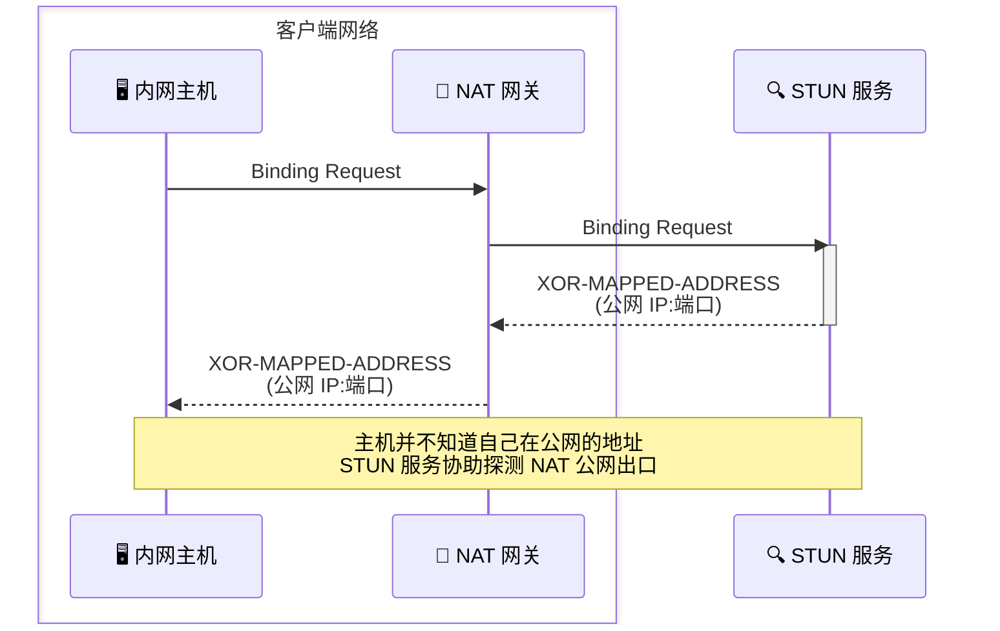

<!-- Copyright © 2026 Techunder (Guanhua Liu) | All Rights Reserved | https://techunder.tech | Email: techunder@163.com -->

Peer-to-Peer

   原创
  发布时间：2026-07-02 | 更新时间：2026-07-02



Peer-to-Peer 是去中心化的点对点通信技术，数据不经过服务器转发。但因为对端（Peer）通常都藏在 NAT 网关后面，无法直接触达对端，需要服务器协助完成 NAT 网关的穿透。

但并不是所有类型的 NAT 网关都能穿透成功的，得分情况讨论。

# NAT 分类

> [!NOTE]
> 话说未来的某一天，每个人对个人隐私都非常注重，人人都隐藏了自己的具体家庭地址（别人最多知道住宅所在小区），不能通过地址直接寄送东西。所有住宅区都实行了全封闭管理，来往物流受到了严格的管控。如果要寄送物品，得**先短时租用小区门口快递柜的一个格口**，填入收件人地址（通常都是公开的公共地址）和收件人电话号码，把物品放入格口寄送出去。在寄送的物品发出后，**短期内该快递格口仍归租用人使用**，可以用于接收短时要回寄的物品。如果要接收快递，也得先短时租用一个快递格口，并主动向对方寄出一封信，让对方知道自己的快递格口信息，以便接收快递。不同的住宅小区实行了不同的快递柜使用规则。

**NAT 网关的工作方式是，只要发起方来自局域网内部，就会把内网的源IP和端口映射到网关的外网 IP 和端口上，以便把对方的回复转发回内网的主机上。**

例如 NAT 网关的外网 IP 为 `121.197.216.227`，内网主机 `192.168.1.100` 以源端口 `34567` 通过 NAT 网关访问公网服务 `1.2.3.4:443`，请求会在 NAT 网关上被映射到源端口 `45678` 访问公网。
（`192.168.1.100:34567` ↔ `121.197.216.227:45678` ↔ `1.2.3.4:443`）

NAT 的类型有：
- 全锥 NAT
- IP 受限锥 NAT
- IP:Port 受限锥 NAT
- 对称 NAT

## 全锥 NAT

Full Cone NAT

> [!NOTE]
> 只要租用了快递柜的一个格口（必须向任意地址寄出任何东西），就可以在短时间内通过此格口接收任意快递，无论快递的来源地址和源电话号码是什么。

**只要内网的某个主机主动向外网发送数据包，短时间内，允许任意外网 IP 和端口通过该映射转发数据包到该内网主机上。**

例如任意发往 NAT 网关的外网 IP 和映射端口 `121.197.216.227:45678` 的数据包，都会被 NAT 网关转发至内网的 `192.168.1.100:34567` 上。
（`192.168.1.100:34567` ← `121.197.216.227:45678` ← `x.x.x.x:ddd`）

> 唯一的限制是，这个端口映射会有**老化过期**问题，当短时间内（30s～3min）没有活跃的数据包经过，NAT 网关会回收该端口映射以便复用到其他请求上。

> [!TIP]
> 就像从圆锥的一个锥尖扩散到宽阔的锥底，从 NAT 网关的入口一个点处接收外部的数据包，广泛地转发到局域网内的各个 IP 和端口上。或把来源于局域网的各个 IP 和端口的数据包，聚拢到锥尖的一点发出去。

> 常见于老旧的低端路由器、虚拟 NAT 网关，公网已经很少能见到全锥型 NAT 网关。

## IP 受限锥 NAT

IP Restricted Cone

> [!NOTE]
> 租用了快递柜的一个格口并向对方寄出东西后，只有来源于对方地址的快递才能投递到格口中（可以是不同的寄件人电话号码），其他地址的快递会被拒绝。

**只要内网的某个主机主动向外网某个 IP 发送数据包，短时间内，只允许该外网 IP 通过该映射转发数据包到该内网主机上，无论该外网 IP 使用什么端口。**

例如任意发往 NAT 网关的外网 IP 和映射端口 `121.197.216.227:45678` 的数据包，都被 NAT 网关转发至内网的 `192.168.1.100:34567` 上。
（`192.168.1.100:34567` ← `121.197.216.227:45678` ← `1.2.3.4:ddd`）

## IP:Port 受限锥 NAT

IP:Port Restricted Cone

> [!NOTE]
> 租用了快递柜的一个格口并向对方寄出东西后，只有来源于对方地址、对方电话号码的快递才能投递到格口中，其他地址的快递、或是对方地址但源电话号码不一样的快递都会被拒绝。

**只要内网的某个主机主动向外网某个 IP 发送数据包，短时间内，只允许该外网 IP 和端口通过该映射转发数据包到该内网主机上。**

> 锥形 NAT 有一共同特点，就是**内网源端口固定，公网出口端口也会固定**，也就是说它以`内网IP:内网端口`的组合来分配端口映射。

## 对称 NAT

Symmetric NAT

> [!NOTE]
> 每次向不同的收件地址或不同收件人电话号码寄出东西，都必须租用一个单独的快递格口，且对应的格口只接收对应对方地址和电话号码的快递。

**对同一个`内网IP:内网端口`，访问不同的外网的`目标IP:目标端口`时，都会动态分配全新的公网出口端口，也就是说它以`内网IP:内网端口+目标IP:目标端口`的组合来分配端口映射。**

> [!WARNING]
> 只要通信双方中的一方在对称 NAT 网关后，便无法实现 NAT 穿透。因为无法知晓对方准确的公网端口信息。

# 公网出口端口探测

关于公网出口端口探测，可以使用 STUN 服务 （[RFC 8489](https://www.rfc-editor.org/info/rfc8489/)）。

# NAT 类型测定

为了探测用户所在 NAT 网关的类型，可以**使用同一个本地端口**，向两个不同 IP 的 STUN 服务器的相同目标端口，以及同一 STUN 服务器的不同目标端口发送共 3 次 Binding Request 请求（即 `目标IP1:目标端口1`, `目标IP1:目标端口2`, `目标IP2:目标端口1`），判断公网出口端口：
- IF **不同目标 IP 相同目标端口，不同公网出口端口**：对称 NAT
- ELSE IF **相同目标 IP 不同目标端口，相同公网出口端口**：全锥 NAT
- ELSE：IP 受限锥 / IP:Port 受限锥

> [!WARNING]
> 这种方式只能检测出因特网出口 NAT 网关的类型，无法检测内层 NAT 的类型，例如运营商 CGNAT 后面接了家用 NAT 路由器。

# 不同 NAT 类型的穿透办法

- **全锥 NAT**：全锥 NAT 的一方主动向对方发包即可打开P2P通道
- **IP 受限锥 NAT**：双方同步发包打洞，对端可以使用与 STUN 探测时不同的端口
- **IP:Port 受限锥 NAT**：双方同步发包打洞，对端必须使用与 STUN 探测时相同的端口
- **对称 NAT**：不能穿透，只能使用 TURN 服务器中转

> [!WARNING]
> 这只是简化后的网络模型，实际上 NAT 网关可能会多层嵌套，又或者 NAT 网关有不同的 NAT 切换策略，例如一般请求使用受限锥，大流量地址切换为对称 NAT，又或者看端口的盈余情况采用不同的 NAT 策略。所以实际工程中经常采用**全候选对并行遍历打洞**方案。
