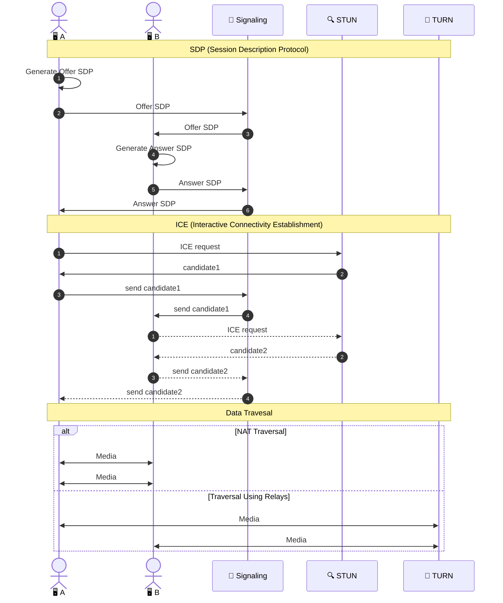
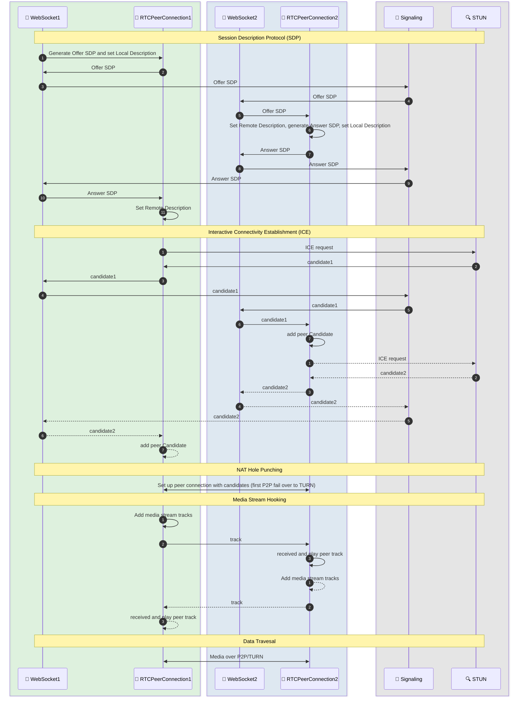

<!-- Copyright © 2026 Techunder (Guanhua Liu) | All Rights Reserved | https://techunder.tech | Email: techunder@163.com -->
<div class="page-title">WebRTC</div>
<div class="page-info">
   <span class="organized-tag">整理</span>
  发布时间：2026-06-30 | 更新时间：2026-06-30
</div>


# 概述

## 名词解释

- **SDP**: Session Description Protocol（会话描述协议）
- **ICE**: Interactive Connectivity Establishment（交互式连接建立）
- **STUN**: Session Traversal Utilities for NAT（NAT 穿透服务）
- **TURN**: Traversal Using Relays around NAT（中继服务）
- **SFU**: Selective Forwarding Unit（媒体分发服务）
- **MCU**: Multipoint Control Unit（多点控制单元）

## 分层结构 

客户端三层：
- 媒体采集层：MediaStream
- 连接管理层：RTCPeerConnection
- 数据通道层：RTCDataChannel

服务端三层：
- 信令层：WebSocket **信令服务**（交换 SDP+ICE）
- ICE 穿透层：**STUN**（公网探测）+ **TURN**（流量中继）
- 媒体分发层：**SFU**（多人会议，开源实现 MediaSoup，可选）

## 整体流程
1. A 打开摄像头，创建 RTCPeerConnection，生成 **Offer SDP**
2. A 通过 WebSocket **信令服务**把 Offer 发给 B
3. B 收到 Offer，生成 **Answer SDP**，再回传给 A
4. 两端同时向 **STUN 服务**请求公网地址，收集 **ICE 候选**（**Candidate**），互相交换地址
5. RTCPeerConnection 尝试按照 ICE 优先级建立 UDP P2P 直连
6. 直连失败，自动切换到 **TURN 中继**模式
7. 连通后，音视频以 RTP 包直接传输（P2P or TURN）
8. 多人会议场景：所有流推送到 **SFU**，再由 SFU 分发定订阅方（可选）



# 客户端

完整流程：



## 媒体采集

MediaStream

- navigator.mediaDevices.getUserMedia（摄像头+麦克风）

Local media:
```javascript
// -- get stream ---------------------------------------------------------------
const constraints = { audio: true, video: { width: 640, height: 480 } };
this.stream = await navigator.mediaDevices.getUserMedia(constraints);
document.createElement('video').srcObject = this.stream;

// -- get tracks ---------------------------------------------------------------
this.stream.getTracks();

// -- disable audio tracks -----------------------------------------------------
this.stream.getAudioTracks().forEach(t => t.enabled = false);

// -- disable video tracks -----------------------------------------------------
this.stream.getVideoTracks().forEach(t => t.enabled = false);

// -- stop tracks --------------------------------------------------------------
this.stream.getTracks().forEach(t => t.stop());
```

Remote media:
```javascript
// -- create stream ------------------------------------------------------------
this.remoteStream = new MediaStream();
this.remoteStream.addTrack(ev.track);
document.createElement('video').srcObject = this.remoteStream;
```

- getDisplayMedia（屏幕共享）

## 连接管理

RTCPeerConnection

  负责端到端建立连接、传输音视频数据流，是最核心对象。

  主要职责：
  - 生成 SDP 会话描述（Offer / Answer），但不负责发送到peer
  - 向 STUN 请求，收集 ICE 候选地址，但不负责发生到peer
  - 协商编解码器（H.264、VP8、VP9、AV1、OPUS）
  - 收发 RTP/RTCP 媒体包
  - 处理网络抖动、丢包、拥塞控制

```javascript
// -- new peer connection ------------------------------------------------------
const iceServers = [{urls: ['stun:a.example.com:1231']}, {urls: ['turn:b.example.com:1232']}];
this.pc = new RTCPeerConnection({ iceServers });
this.pc.addEventListener('icecandidate', (ev) => {
    // send `candidate` to peers through signaling server
    const candidate = {
        candidate: ev.candidate.candidate,
        sdpMid: ev.candidate.sdpMid,
        sdpMLineIndex: ev.candidate.sdpMLineIndex,
    }
});
this.pc.addEventListener('track', (ev) => {
    this.remoteStream = new MediaStream();
    this.remoteStream.addTrack(ev.track);
    document.createElement('video').srcObject = this.remoteStream;
});
this.pc.addEventListener('connectionstatechange', () => {
    const s = this.pc.connectionState;
    if (s === 'connected') {
        // connected
    } else if (s === 'failed') {
        // failed
    } else if (s === 'disconnected') {
        // disconnected
    }
});

// -- create offer -------------------------------------------------------------
const offer = await this.pc.createOffer({ offerToReceiveAudio: true, offerToReceiveVideo: true });
// then send `offer.sdp` to peer through signaling server

// -- create answer ------------------------------------------------------------
const answer = await this.pc.createAnswer();
// then send `answer.sdp` to peer through signaling server

// -- set local description ----------------------------------------------------
await this.pc.setLocalDescription(offer);
// access local description
this.pc.localDescription

// -- set remote description ---------------------------------------------------
// (type='offer' if peer proactively offer it, 
//  type='answer' if peer answered my offer, through signaling server)
await this.pc.setRemoteDescription({ type: 'offer'|'answer', sdp });
// access remote description
this.pc.remoteDescription

// -- add ice candidate --------------------------------------------------------
await this.pc.addIceCandidate(c);

// -- add local tracks ---------------------------------------------------------
tracks = this.stream.getTracks();
if (tracks.length) {
    for (const t of tracks) this.pc.addTrack(t, this.stream);
}
// get local sedding tracks
this.pc.getSenders()

// -- close peer connection ----------------------------------------------------
this.pc.close();
```

## 数据通道

RTCDataChannel

在同一个 P2P 链路上传输非媒体数据：文字、文件、二进制消息，基于 UDP，低延迟。

# 服务端

- 信令服务
- ICE 服务（STUN + TURN）
- SFU（可选）

## 信令服务

Signaling Server（必备）

WebRTC 本身不内置信令通道，必须自建服务交换协商信息。

交换内容：
- SDP（Offer/Answer）
- ICE 网络候选地址

信令服务只交换控制信令，不转发音视频流量。

## STUN

NAT 穿透服务 STUN（Session Traversal Utilities for NAT，必备）

客户端向 STUN 服务器发送请求，拿到自身外网地址（IP + 端口），生成 ICE 候选。

正常网络环境下，拿到公网地址后两端可以直接 P2P，不走流量中转。

## TURN

中继服务 TURN（Traversal Using Relays around NAT，备用必备）

当多层 NAT、对称 NAT、防火墙严格拦截，两端无法直连 P2P 时，自动降级为所有音视频流量全部经过 TURN 服务器中转。

常见的协议有 TURN over UDP / TCP / TLS。

要承载媒体流量，带宽消耗大，成本高。

> [!NOTE]
> 工程上一般把 STUN + TURN 部署在同一套服务，统称 ICE Server。

## SFU

多人视频会议（3 人及以上）的场景下，P2P 会形成网状连接，带宽爆炸，需要使用引入 **SFU**（Selective Forwarding Unit）。

SFU 工作机制：
- 每个客户端只向上行发送一路视频流给 SFU
- SFU 只做流量分发，把流分发给其他所有参会者

MCU（Multipoint Control Unit）是把多路上行画面混合成一路画面再下发的机制，其 CPU 开销高，常见于老旧视频会议系统。

# References

- [W3C WebRTC API](https://www.w3.org/TR/webrtc/)
- IETF RTCWEB (RFC)
    - ICE
        - [RFC 8445: Interactive Connectivity Establishment (ICE): A Protocol for Network Address Translator (NAT) Traversal](https://www.rfc-editor.org/info/rfc8445/)
        - [RFC 8863: Interactive Connectivity Establishment Patiently Awaiting Connectivity (ICE PAC)](https://www.rfc-editor.org/info/rfc8863/)
        - [RFC 8866: SDP: Session Description Protocol](https://www.rfc-editor.org/info/rfc8866/)
    - STUN
        - [RFC 8489: Session Traversal Utilities for NAT (STUN)](https://www.rfc-editor.org/info/rfc8489/)
        - [RFC 7350: Datagram Transport Layer Security (DTLS) as Transport for Session Traversal Utilities for NAT (STUN)](https://www.rfc-editor.org/info/rfc7350/)
        - [RFC 7064: URI Scheme for the Session Traversal Utilities for NAT (STUN) Protocol](https://www.rfc-editor.org/info/rfc7064/)
    - STUN
        - [RFC 8656: Traversal Using Relays around NAT (TURN): Relay Extensions to Session Traversal Utilities for NAT (STUN)](https://www.rfc-editor.org/info/rfc8656/)
        - [RFC 8155: Traversal Using Relays around NAT (TURN) Server Auto Discovery](https://www.rfc-editor.org/info/rfc8155/)
        - [RFC 6062: Traversal Using Relays around NAT (TURN) Extensions for TCP Allocations](https://www.rfc-editor.org/info/rfc6062/)
        - [RFC 7065: Traversal Using Relays around NAT (TURN) Uniform Resource Identifiers](https://www.rfc-editor.org/info/rfc7065/)
    - RTP
        - [RFC 3550: STD 64: RTP: A Transport Protocol for Real-Time Applications](https://www.rfc-editor.org/info/rfc3550/)
        - [RFC 7728: RTP Stream Pause and Resume](https://www.rfc-editor.org/info/rfc7728/)
        - [RFC 3711: The Secure Real-time Transport Protocol (SRTP)](https://www.rfc-editor.org/info/rfc3711/)
        - [RFC 9147: The Datagram Transport Layer Security (DTLS) Protocol Version 1.3](https://www.rfc-editor.org/info/rfc9147/)
    - other
        - [RFC 8827: WebRTC Security Architecture](https://www.rfc-editor.org/info/rfc8827/)
        - [RFC 8828: WebRTC IP Address Handling Requirements](https://www.rfc-editor.org/info/rfc8828/)

