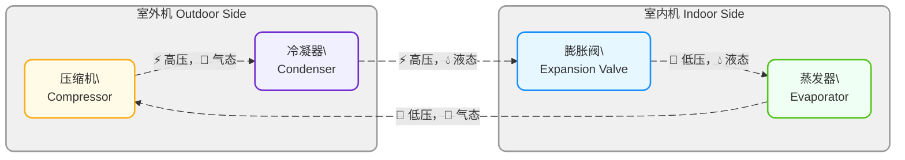
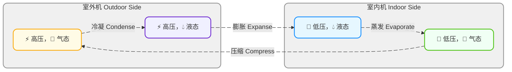

<!-- Copyright © 2026 Techunder (Guanhua Liu) | All Rights Reserved | https://techunder.tech | Email: techunder@163.com -->

空调

   原创
  发布时间：2026-07-26 | 更新时间：2026-07-26



# 工作原理

四大部件：

冷媒状态：

- **压缩机**（Compressor）：对气态**冷媒**进行压缩，低压低温 → 高压高温（高压，气态）
- **冷凝器**（Condenser）：对冷媒风冷，散热后变成液体，气态 → 液态（高压，液态）
- **膨胀阀**（Expansion Valve）：高压液态冷媒经过小孔降压，高压高温 → 低压低温，进入室内机（低压，液体）
- **蒸发器**（Evaporator）：在室内机管路吸热蒸发变成气体，液态 → 气态（低压，气态）

> [!NOTE]
> 冰箱制冷原理相同，但四大部件同体，热量直接排到冰箱外

# 种类

- **定频**：压缩机转速固定（50Hz），要么全开，要么全停，结构简单，温度波动大
- **变频**：压缩机转速可变（15~120Hz），平滑控制压缩功率，需要变频器，温度平滑稳定
    - **交流变频**，老旧淘汰
    - **直流变频**，目前主流

# 功率

“**匹**”是压缩机的功率单位，最早 1匹 = 1 马力 = 735 瓦，现变成了行业俗称，并非精确对应关系，对应制冷量。

> [!TIP]
> 可以理解为一“匹”马

常见数值：

- 小 1 匹：制冷量 2300W 左右
- 1 匹：制冷量约 2300W～2600W，适合 10～15㎡房间
- 大 1 匹：制冷量 2800～3000W
- 1.5 匹：制冷量约 3200W～3600W，适合 15～20㎡
- 大 1.5 匹：约 4000W
- 2 匹：制冷量约 5000W，适合 20～30㎡
- 3 匹：7200W 左右，客厅常用

# 常见问题

- **水凝**：室内机出风口温度较低，容易凝结热空气中的水分子，形成水滴，需要导流管把冷凝水排到室外。
- **干燥**：室内机与空气接触部分冷凝吸收空气中的水分，排到到室外，形成干燥。
- **噪音**：压缩机变频工作，可能会工作在结构固有频率上，发生**共振**，形成低频 “嗡嗡轰鸣”噪音，甚至整机明显抖动。
    厂家出厂前会测出共振频段，让电控程序跳过共振频率工作，但机器老化、安装松动后，与出厂标准工况差异会导致跳频逻辑失效。
- **空气不流通**：室内外机空气不连通，开空调的房间通常密闭以避免热空气流入，导致室内空气浑浊。有些空调会加入新风功能。

