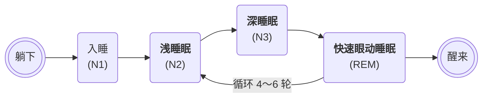

<!-- Copyright © 2026 Techunder (Guanhua Liu) | All Rights Reserved | https://techunder.tech | Email: techunder@163.com -->

睡眠健康

   整理
  发布时间：2026-07-03 | 更新时间：2026-07-03



# 睡眠周期

一个标准睡眠周期约 90 分钟左右（范围 70～110 分钟）。

1. **N1 入睡**（过渡期，5～10min）

    刚闭眼犯困、半醒半睡，大脑活跃度下降，容易被轻微声响惊醒；

    持续很短，仅 5～10 分钟。

2. **N2 浅睡眠**（占整晚睡眠 50% 左右，40～50min）

    真正进入睡眠，体温、心率缓慢下降，大脑产生睡眠纺锤波；

    日常大部分睡眠时间都在 N2，身体轻度休息，容易唤醒。

3. **N3 深睡眠**（20～30min，前半夜长，后半夜大幅缩短甚至消失）

    脑电波低频慢波为主，HRV 显著升高、心率呼吸平稳放缓；

    肌肉完全放松，生长激素大量分泌，修复身体、恢复体力、巩固长期记忆；

    很难叫醒，醒来会昏沉乏力；

    前半夜深睡占比高，越往后深睡越来越短。

4. **REM 快速眼动睡眠**（做梦阶段，10～30min，越到凌晨越长）

    深睡结束后进入 REM，眼球快速左右转动；

    心率、呼吸变得不规律，血压小幅波动，大脑活跃度接近清醒；

    绝大多数梦境发生在此阶段，**肌肉临时瘫痪防止肢体乱动**；

    后半夜 REM 时长持续变长，凌晨时段 REM 最久；

    一轮结束后，会短暂回到轻度 N2，开启下一轮循环。

第 1、2 轮（前半夜）：深睡眠占比很高，REM 很短；

第 3、4、5 轮（后半夜、凌晨）：深睡眠大幅减少甚至没有，REM 持续拉长；

清晨醒来大多刚好从 REM 阶段脱离。

# 呼吸与心率

## 心率范围

- **清醒静息状态**：
    - 正常区间：60～100 次 / 分钟
    - 理想区间：55～75 次 / 分

- **睡眠状态**：
    - 浅睡：55～90 次 / 分
    - 深睡：明显下降，50～70 次 / 分，心肺好的人可低至 45 左右
    - REM：心率小幅波动、轻微升高

## 呼吸范围

- **清醒静息状态**：12～20 次/分
- **睡眠状态**：8～16 次/分，节律均匀

# 心率变异性 HRV

并不是每一次的心跳间隔都相等，例如：
- 心跳 1 与 2：间隔 0.92s
- 心跳 2 与 3：间隔 0.95s
- 心跳 3 与 4：间隔 0.90s

这种**心跳间隔微小的波动差异**，就叫**心率变异性 HRV**（Heart Rate Variability）。

## 底层原理：自主神经调控

HRV 直接反映交感神经、副交感神经（迷走神经） 的平衡状态：
- **副交感神经**：放松、休息、睡眠时占优，拉长心跳间隔、波动变大，**HRV 数值高**，代表恢复力强、压力低、睡眠质量好。
- **交感神经**：紧张、焦虑、劳累、熬夜、生病时激活。心跳变匀、波动缩小，**HRV 数值低**，代表身体处于应激、疲劳、修复能力差。

睡眠时 HRV 值高，代表睡眠质量好：
- **清醒 / 浅睡**：交感偏活跃，HRV 中等偏低
- **深睡眠**：迷走神经主导，HRV 显著升高，是身体修复黄金阶段
- **REM 做梦期**：神经波动大，HRV 起伏不定

## RR 与 NN 间期

标准心电图单次心跳波形分为：P、Q、R、S、T 波：
- P 波：心房收缩
- Q、R、S：心室收缩，其中 R 波是整个波形最高、最尖锐的主峰

两个相邻心跳的主峰之间的**时间间隔**，就叫 RR 间期（R wave to R wave）。
- RR：所有心跳间隔（含早搏、异常心跳）
- NN（Normal-to-Normal）：只筛选正常窦性心跳的间隔，剔除早搏、漏跳等异常搏动

## HRV 指标

### SDNN

正常 RR 间期（即NN）的**标准差**（Standard Deviation of Normal-to-Normal intervals）。

参考值：
- ＞50ms：自主神经调节好、恢复力强
- 30～50ms：普通水平
- ＜30ms：长期疲劳、压力大、睡眠差

### RMSSD

相邻两个 RR 间期差值的**均方根**（Root Mean Square of Successive Differences）。

专门反映迷走神经（副交感神经）活性，深呼吸、深睡、放松时 RMSSD 明显升高；焦虑、憋气、呼吸暂停会暴跌。

计算公式：$\sqrt{\frac{1}{N}\sum_{n=1}^{N}(RR_{n+1}-RR_n)^2}$
1. 算出每一组连续心跳间隔之差 $\vert RR_{n+1}-RR_n \vert$
2. 全部差值平方、求平均、再开根号

### pNN50

相邻 RR 间期差值大于 50ms 的心跳占总心跳的**百分比**（Percentage of NN50）

正常放松时，相邻心跳会有明显起伏，差值＞50ms 次数多；压力大、心跳死板时几乎没有。

参考：健康放松状态 pNN50 通常＞10%；长期疲劳常接近 0。

### 平均心率间期

平均心率间期（平均 RR 间期）= 全部心跳间隔的平均值（ms）。

与心率的换算关系：心率 (次/分) = 60000 ÷ 平均 RR 间期。

平均 RR 间期越大，心跳越慢。

### 平均呼吸间期

平均呼吸间期 = 呼吸一次（完整一吸一呼）的平均时间，单位秒/次

与呼吸频率的换算关系 = 60 ÷ 平均呼吸间期

