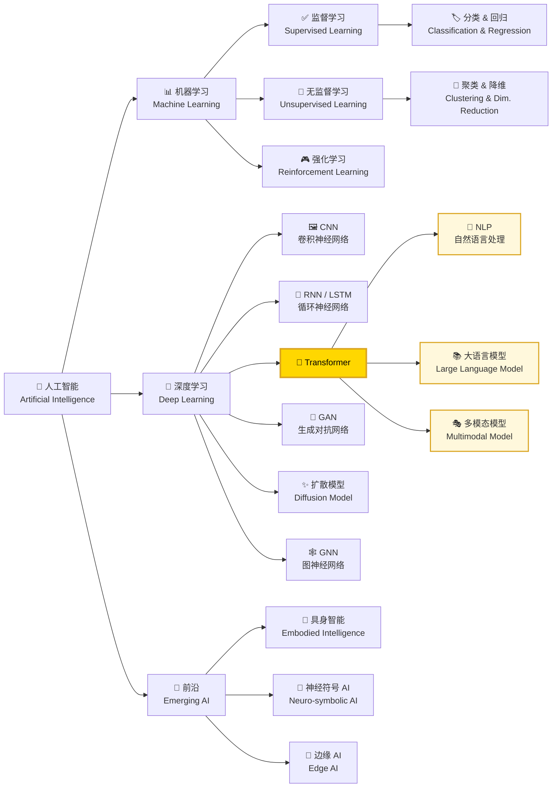
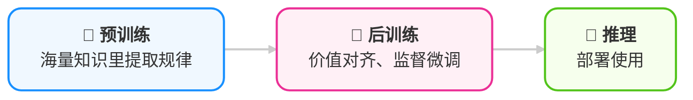
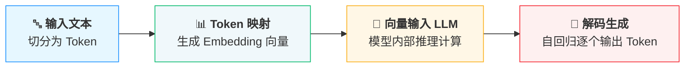
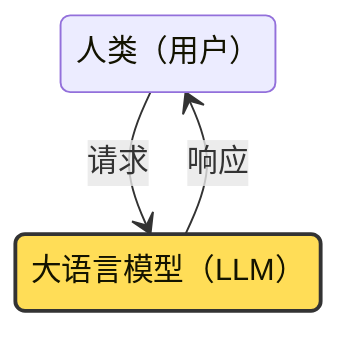
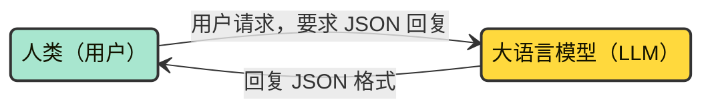
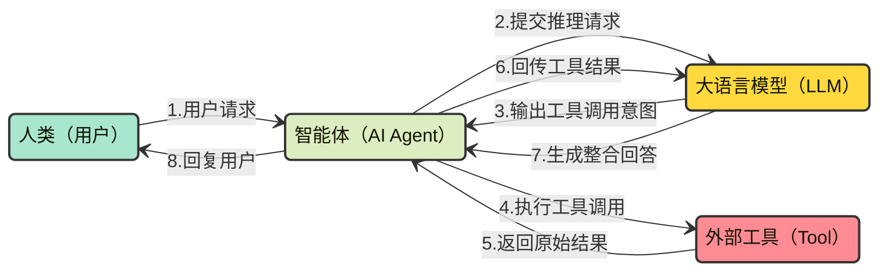

<!-- Copyright © 2026 Techunder (Guanhua Liu) | All Rights Reserved | https://techunder.tech | Email: techunder@163.com -->

<div class="page-title">LLM，智力的源头</div>
<div class="page-info">
   <span class="original-tag">原创</span>
  发布时间：2026-04-14 | 更新时间：2026-04-18
</div>


要好用 AI Agent，我们需要先理解其核心：**大语言模型**（Large Language Model）

本文介绍应用 LLM，我们需要知道的知识。

# 人工智能

人工智能经过几十年的发展，已经形成庞大的一系列分支



<center>（图：人工智能的主要分支）</center>

> 当前大放异彩的 LLM 就是属于 Tranformer 这一支

# 深度学习

深度学习是通过**深度神经网络**实现的，它模拟了人类的大脑神经网络结构。

<p>
  
  
</p>


<center>（图：计算机深度神经网络）</center>

深度神经网络由大量神经元组成，**每层神经元接收前一层输出的加权和，经过激活函数实现非线性变换后传递给下一层**，最终到达输出层。输出层根据任务类型给出相应形式的输出：
- **多分类任务**：经过 softmax 函数归一化为各类别的概率分布，常选择概率最高的作为预测结果
- **二分类任务**：经 sigmoid 函数输出 0 到 1 之间的标量值，可视为正类概率
- **回归任务**：无激活函数，直接输出线性结果

{}
### 加权求和激活
```katex
\boldsymbol{a}_{next} = \sigma(\boldsymbol{a}^T \boldsymbol{W} + \boldsymbol{b})
```
设按上一层 m 个神经元与当前层 n 个神经元**全连接**，其中
- $\boldsymbol{a}$ 为上一层的输出，shape 为 (m,1)
- $\boldsymbol{W}$ 为当前层的权重，shape 为 (m,n)
- $\boldsymbol{b}$ 为当前层的偏置，shape 为 (n,1)
- $\sigma$ 为激活函数，常见为：
    - $relu(x) = max(0, x)$，输出 $\ge 0$， 主流
    - $sigmoid(x) = \frac{1}{(1+e^{-x})}$，输出 0~1
    - $tanh(x) = \frac{e^x-e^{-x}}{e^x+e^{-x}}$，输出 -1~1
---
### Softmax
```katex
\text{softmax}(\boldsymbol{x}) = 
\begin{bmatrix} 
\text{softmax}(\boldsymbol{x})_1 \\ 
\text{softmax}(\boldsymbol{x})_2 \\ 
\cdots \\ 
\text{softmax}(\boldsymbol{x})_n 
\end{bmatrix}
```
其中 $\boldsymbol{x}$ 为向量
```katex
\text{softmax}(\boldsymbol{x})_i = \frac{e^{x_i}}{\sum_{j=1}^n e^{x_j}}
```
{}

一般的过程是通过训练得到权重 $\boldsymbol{W}$，封装成模型，再投放到应用场景中做推理。

不同的模型，会设计不同的神经网络架构，有不同的权重参数量。

> [!TIP]
> 深度学习是建立在**概率论**之上的一门技术，对它来说，没有 100% 的必然 —— 每次输出只是当前条件下概率较高的输出，而非逻辑运算后的确定结果

> LLM 通常使用 `temperature` 或 `top_p` 参数来控制输出采样策略

# 大语言模型

大语言模型（LLM）是智能体的核心引擎和智力源泉。

现代的 LLM 基本是 **Transformer 架构** 或其变体，始于 Google Brain 团队于 2017 年发表的一篇论文《Attention Is All You Need》。


<center>（图：Transformer 模型架构）</center>

> [!NOTICE]
> 像 GPT 这一类**生成大模型**，只有右边的架构（Decoder-only），输出是一个字一个字往外蹦

> [!NOTICE]
> 像 BERT 这一类**理解模型**，只有左边的架构（Encoder-only），直接吐出整个语句的结果，用于分类、embedding 或意图理解

Transformer 是一种基于**自注意力机制**的深度神经网络架构，核心模块是**多头自注意力**结构。

通过投喂海量的通用知识，让其习得了其中的规律，并保存为模型的权重参数，这个过程称为**预训练**（Pre-training）。

之后需要经过价值对齐、监督微调等的**后训练**（Post-training）过程才能上线使用。



> [!TIP]
> 模型以人类自然语言为基础习得，且权重参数量巨大，故名**大语言模型**

# 推理过程

使用过程中，让 LLM 生成内容的过程成为**推理**（inference），大语言模型推理过程是这样的：





例如 “我喜欢大自然” 会被拆分成 「我」、「喜欢」、「大」、「自然」 这四个 token。

人类自然语言里所有 token（词元）会组成一个**词库**。

词库里的每一个 token 都可以通过 **embedding model**（嵌入模型）生成对应的高维 embedding 向量。

> [!WARNING]
> embedding model ≠ LLM

生成的 embedding 向量不是随意的，而**是对人类自然语言进行大量学习后摸索出规律，使得语义相关性高的 token 向量值也比较类似**。

几个 embedding 例子：

- man ≈ 男人
- 美丽 ≈ 漂亮
- king - man + woman ≈ queen

不同的企业或开源社区，都可以训练出自己的 embedding model。

不同的 embedding model 的向量维度可以不一样。

> 例如 `paraphrase-multilingual-MiniLM-L12-v2` embedding model 的维度为 384。

想更深入了解 embedding 的知识，请看这篇：[embedding](/docs/embedding/)

对 LLM 的调用，通过输入和输出的 token 计费。

> [!TIP]
> LLM 以 token 为计量单位，token 是 AI 时代像“电”一样的存在，为能源消耗单位，消耗 token 得到推理结果

# 上下文长度

**LLM 是无状态的，只有权重与矩阵函数运算**，所有的惊喜，都藏在输入里，输入称为**提示词**（prompt）。

> [!TIP]
> 有提示 LLM 产生期望输出之意

> 所以早期关于 LLM 的应用工程，叫**提示词工程**（Prompt Engineering）



因为 LLM 无状态，所以每一次请求，都必须带上完整的**上下文**（context）信息，让 LLM 知道前面对话的内容

> 所以后来关于 LLM 的应用工程，也叫**上下文工程**（Context Engineering）

下面模拟一个含有多轮对会的过程，

{}
{}
1. ### 第一轮请求
    1. **人类**：<span style="color:blue;">你好，什么是白开水？</span>
2. ### 第一轮回复
    1. **模型**：白开水就是烧开之后冷却的饮用水，干净又健康。
3. ### 第二轮请求
    1. **人类**：你好，什么是白开水？
    1. **模型**：白开水就是烧开之后冷却的饮用水，干净又健康。
    1. **人类**：<span style="color:blue;">那多喝白开水有什么好处？</span>
4. ### 第二轮回复
    1. **模型**：可以补充身体水分、促进代谢，缓解口干，帮助身体保持舒服的状态。
5. ### 第三轮请求
    1. **人类**：你好，什么是白开水？
    1. **模型**：白开水就是烧开之后冷却的饮用水，干净又健康。
    1. **人类**：那多喝白开水有什么好处？
    1. **模型**：可以补充身体水分、促进代谢，缓解口干，帮助身体保持舒服的状态。
    1. **人类**：<span style="color:blue;">平时什么时候喝水最合适呢？</span>
6. ### 第三轮回复
    1. **模型**：早上起床后、运动结束后、口渴时、饭前半小时，都适合喝一点温水。
7. ### 第四轮请求
    1. **人类**：你好，什么是白开水？
    1. **模型**：白开水就是烧开之后冷却的饮用水，干净又健康。
    1. **人类**：那多喝白开水有什么好处？
    1. **模型**：可以补充身体水分、促进代谢，缓解口干，帮助身体保持舒服的状态。
    1. **人类**：平时什么时候喝水最合适呢？
    1. **模型**：早上起床后、运动结束后、口渴时、饭前半小时，都适合喝一点温水。
    1. **人类**：<span style="color:blue;">能不能给我整理 3 条简单的喝水小建议？</span>
8. ### 第四轮回复
    1. **模型**：① 不要等到很渴才喝水；② 少量多次慢慢喝；③ 少喝饮料，多用白开水代替。
9. ### 第五轮请求
    1. **人类**：你好，什么是白开水？
    1. **模型**：白开水就是烧开之后冷却的饮用水，干净又健康。
    1. **人类**：那多喝白开水有什么好处？
    1. **模型**：可以补充身体水分、促进代谢，缓解口干，帮助身体保持舒服的状态。
    1. **人类**：平时什么时候喝水最合适呢？
    1. **模型**：早上起床后、运动结束后、口渴时、饭前半小时，都适合喝一点温水。
    1. **人类**：能不能给我整理 3 条简单的喝水小建议？
    1. **模型**：① 不要等到很渴才喝水；② 少量多次慢慢喝；③ 少喝饮料，多用白开水代替。
    1. **人类**：<span style="color:blue;">好的，帮我简单总结一下这段内容。</span>
10. ### 第五轮回复
    1. **模型**：简单来说，白开水健康有益，日常要养成定时、少量多次喝水的好习惯，少喝含糖饮料。
{}
{}

你发现了吗？会话雪球越滚越大！

> 以上例子是按类似 OpenAI 的 `/v1/chat/completions` Chat Completions API 视觉展开的。如果采用较新的 `/v1/responses` Responses API，不用每次都把会话上下文传过去，只需要发送最新的问题即可，服务端会维护会话的上下文，接口会更简洁，减少了传输开销，但 token 消耗并不会因此而减少。

但在 LLM 里，对每一次请求，从 prompt 的第一个 token 开始到已经生成的 token，都会参与到自注意力运算才能输出下一个 token，

> [!TIP]
> 就好像一本几百页的小说，开篇的一句话，也会影响到结尾处的结局

所以每一个 LLM，都有一个叫**上下文长度**（context length）的硬指标，来限定 prompt token 加上能生成 token 数的上限（以 token 个数为计量单位）

> 例如，模型 `DeepSeek-V3.2` 的上下文长度为 128K，`MiniMax-M2.7` 200K，`Qwen3.6-Plus` 为 1M

> [!WARNING]
> 过长的上下文会让 KV 缓存爆炸、单 token 平均注意力降低，但更核心的问题是模型能否在海量 tokens 中准确定位关键信息

> [!TIP]
> 随着大模型的发展，context length 可能会越来越大，但限于算力和显存资源，是不可能无限增长的，所以**上下文工程**就是围绕这个问题而诞生的工程方法

我们在日常的 LLM 使用中，最关心的莫过于当前 context length 还剩下多少。

> 事实上，LLM 所在的服务一般是有缓存（**KV Cache**）的，因为通常一个 session 都会有多轮对话，每一次轮对话的输入 prompt 的前面部分都是一样的，而 prompt 里所有的 token 都是需要映射为 K（Key） 和 V（Value） 向量并参与到后面每个 token 的生成，所以 LLM 服务通常会缓存 token 的 KV，用于后续对话的计算

想更深入了解自注意力机制，请看这篇：[自注意力机制](/docs/transformer/1-self-attention/)

# 结构化输出

像前面的例子，人类与 LLM 的对话，一般是输出一段自然语言文本，为了支持流程程序化，现在很多 LLM 都支持**结构化输出**（一般是 JSON 格式）。



{}
```python
# copied and modified from `https://api-docs.deepseek.com/zh-cn/guides/json_mode`
import json
from openai import OpenAI

client = OpenAI(
    base_url="https://api.deepseek.com",
)

system_prompt = """
用户将提供一些考试文本。请从中解析出「问题」与「答案」，并以 JSON 格式输出。

示例输入：
世界上最高的山峰是什么？珠穆朗玛峰。

示例 JSON 输出：
{
    "question": "世界上最高的山峰是什么？",
    "answer": "珠穆朗玛峰"
}
"""

user_prompt = "世界上最长的河流是哪条？尼罗河。"

messages = [{"role": "system", "content": system_prompt},
            {"role": "user", "content": user_prompt}]

response = client.chat.completions.create(
    model="deepseek-chat",
    messages=messages,
    response_format={
        'type': 'json_object'
    }
)

print(response.choices[0].message.content)
```
输出结果
```json
{
    "question": "世界上最长的河流是哪条？", 
    "answer": "尼罗河"
}
```
{}

有了这个能力，我们可以把 LLM 的结构化输出交由下游的程序继续处理了，这便可以把 LLM 串联到程序的工作流中，实现智能自动化。 

接下来看看结构化输出的升级版 —— LLM 工具调用。

# 工具调用

所谓**工具调用**（tool calling，也可叫 function calling），就是 **LLM 跟据上下文判断用户意图，生成函数调用的代码**。

典型的流程是这样子的：



```text
人类>    佛山的天气怎么样？
模型>    【调用工具】: get_weather, 【参数】: {"location": "佛山"}
工具>    多云，气温 24-30°C，湿度 69%，微风。
模型>    根据查询结果，佛山今天的天气情况如下：

- **天气状况**：多云
- **气温**：24-30°C
- **湿度**：69%
- **风力**：微风

今天佛山天气比较舒适，温度适中，多云天气，微风习习，适合外出活动。建议穿着轻薄衣物即可。

```

{}
```python
# copied and modified from `https://api-docs.deepseek.com/zh-cn/guides/tool_calls`
import json

from openai import OpenAI

def get_weather(location: str) -> str:
    """Get weather of a location (demo with fixed data)."""
    weather_data = {
        "北京": "小雨，气温 15-22°C，湿度 80%。",
        "上海": "晴，气温 22-28°C，湿度 50%。",
        "广州": "多云，气温 25-30°C，湿度 70%。",
        "佛山": "多云，气温 24-30°C，湿度 69%，微风。",
    }
    return weather_data.get(location, f"{location}天气：数据暂缺，请稍后再试。")


# 注册工具函数
TOOL_FUNCTIONS = {
    "get_weather": get_weather,
}

def send_messages(messages):
    response = client.chat.completions.create(
        model="deepseek-chat",
        messages=messages,
        tools=tools
    )
    return response.choices[0].message

client = OpenAI(
    base_url="https://api.deepseek.com",
)

tools = [
    {
        "type": "function",
        "function": {
            "name": "get_weather",
            "description": "获取指定城市的天气，用户需要先提供具体位置。",
            "parameters": {
                "type": "object",
                "properties": {
                    "location": {
                        "type": "string",
                        "description": "城市名称，例如广州",
                    }
                },
                "required": ["location"]
            },
        }
    },
]

messages = [{"role": "user", "content": "佛山的天气怎么样？"}]
print(f"人类>\t {messages[0]['content']}")

message = send_messages(messages)
messages.append(message)

tool = message.tool_calls[0] if message.tool_calls else None
if not tool:
    # 无工具调用意图，正常回复用户
    print(f"模型>\t {message.content}")
else:
    print(f"模型>\t 【调用工具】: {tool.function.name}, 【参数】: {tool.function.arguments}")

    # 检测到 LLM 的工具调用意图，发起工具调用
    args = json.loads(tool.function.arguments)
    func_name = tool.function.name
    func = TOOL_FUNCTIONS.get(func_name)
    tool_result = func(args["location"])
    print(f"工具>\t {tool_result}")

    # 向 LLM 返回工具调用原始结果
    messages.append({"role": "tool", "tool_call_id": tool.id, "content": tool_result})
    message = send_messages(messages)
    print(f"模型>\t {message.content}")
```
{}

> [!TIP]
> **编程语言是目前为止最精确的意图表达方式**，不是自然语言，不是图片，是代码。自然语言还需要一个翻译层，而代码可以直接转换成行动。

> [!TIP]
> **LLM 的 tool calling 能力是 AI Agent 能够接管世界的开始**，是这位“文科生”由文转理的起点。
> 它能读懂自然语言意图，然后生成代码，并交由 AI Agent 执行。
> 这意味着 AI 不再只是回答问题、给出建议的聊天助手，而是可以直接作用于物理世界的机器人。

# LLM 接口

目前市面上的 LLM，大多兼容以下接口之一

{}
```python
from openai import OpenAI

client = OpenAI(
    base_url="<MODEL_BASE_URL>",
    api_key="<YOUR_API_KEY>",
)
# export OPENAI_BASE_URL=${MODEL_BASE_URL}
# export OPENAI_API_KEY=${YOUR_API_KEY}

response = client.chat.completions.create(
    model="<MODEL_NAME>",
    messages=[
        {"role": "system", "content": "You are a helpful assistant."},
        {"role": "user", "content": "Hi, how are you?"},
    ],
    extra_body={"enable_thinking": True},
)
```
{}

{}
```python
from openai import OpenAI

client = OpenAI(
    base_url="<MODEL_BASE_URL>",
    api_key="<YOUR_API_KEY>",
)
# export OPENAI_BASE_URL=${MODEL_BASE_URL}
# export OPENAI_API_KEY=${YOUR_API_KEY}

response = client.responses.create(
    model="<MODEL_NAME>",
    input="Hi, how are you?",
    extra_body={"enable_thinking": True},
)
```
{}

{}
```python
import anthropic

# export ANTHROPIC_BASE_URL=${MODEL_BASE_URL}
# export ANTHROPIC_API_KEY=${YOUR_API_KEY}
client = anthropic.Anthropic()

message = client.messages.create(
    model="<MODEL_NAME>",
    max_tokens=1000,
    system="You are a helpful assistant.",
    messages=[
        {
            "role": "user",
            "content": [
                {
                    "type": "text",
                    "text": "Hi, how are you?"
                }
            ]
        }
    ]
)
```
{}

> 这就是为什么你调用的明明不是 OpenAI 或 Anthropic 的模型，却在使用他们的 SDK 的原因。
> 只要设置正确的模型 URL 和 API Key，模型厂家提供兼容接口。

此外有些模型厂家会有自己格式的接口，例如 Google Gemini 原生接口格式，阿里云百炼的 DashScope 接口格式。

也有像 [OpenRouter](https://openrouter.ai/) 这样的 LLM Gateway，提供接口代理访问其它大模型（兼容 `OpenAI Chat Completions` 接口）

> LLM 也可以本地部署，例如使用 [Ollama](https://ollama.com/)，它提供了自己的接口格式。本地部署需要配置非常高的 GPU 才能跑得起效果尚可的 LLM。
