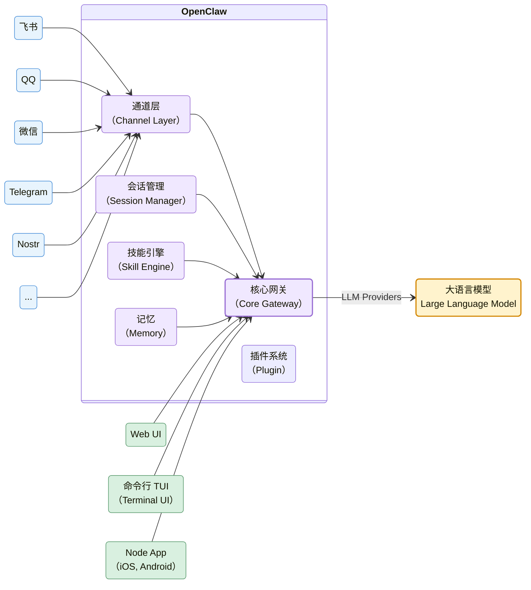
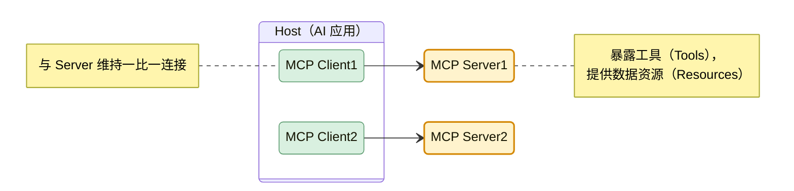
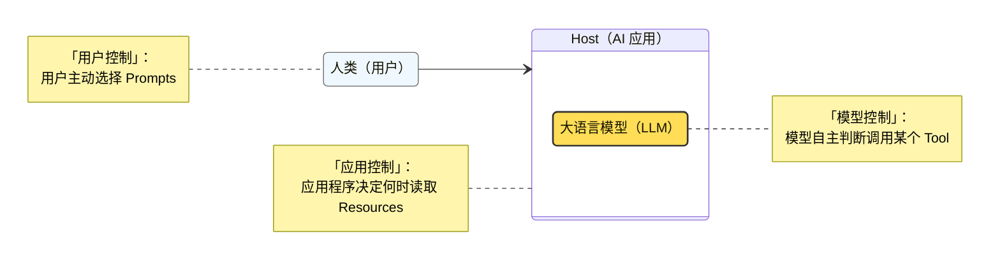
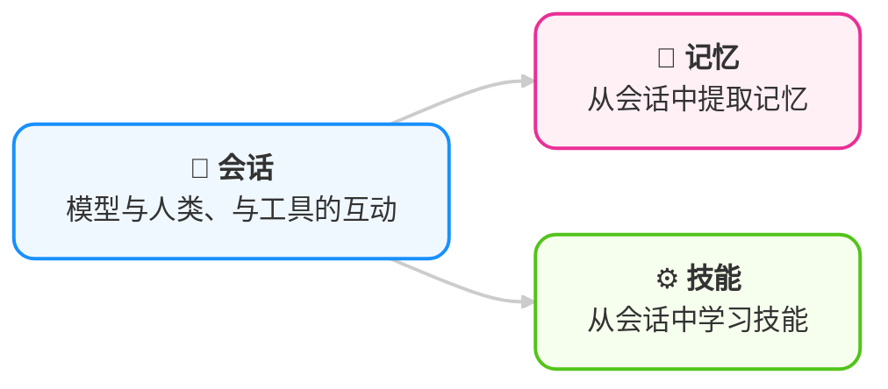
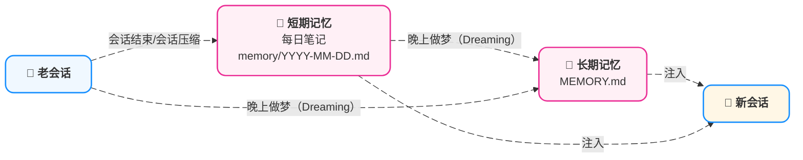

<!-- Copyright © 2026 Techunder (Guanhua Liu) | All Rights Reserved | https://techunder.tech | Email: techunder@163.com -->

<div class="page-title">Agent，工程的起航</div>
<div class="page-info">
   <span class="original-tag">原创</span>
  发布时间：2026-04-19 | 更新时间：2026-04-19
</div>


有了前面基础知识的铺垫，终于来到了 LLM 的实践应用环节 —— 智能体，LLM 的落地应用。

**AI Agent**（智能体）是 2025 年初开始推广开来的围绕 LLM 的工程实践。

随着工程化的成熟，业界已经发展出一套驾驭 LLM 的方法论和最佳实践，

本文按这套工程实践展开，分享 AI Agent 的核心逻辑。

过程中会以当下流行的**个人智能体 [OpenClaw](https://github.com/openclaw/openclaw)** 为例。

# 架构实例：OpenClaw 架构

OpenClaw 的简要架构如下：



OpenClaw 是运行在用户自有服务器（或个人电脑）上的私有 AI Agent 框架。

消息经由 Channel Layer 接入，由 Core Gateway 统一路由，配合 Session Manager 管理对话上下文，技能引擎与记忆模块提供长期能力，最终调度 LLM 生成回复。

{}
- **通道层（Channel Layer）**

    消息适配层，将各平台（QQ、飞书、Telegram、Nostr 等）格式统一为内部 schema，再送入 Gateway。

- **核心网关（Core Gateway）**

    消息路由核心，负责鉴权、会话分发、上下游协调。是整个系统的中枢。

- **会话管理（Session Manager）**

    管理对话生命周期、上下文窗口、跨 session 记忆与状态持久化。

- **技能引擎（Skill Engine）**

    技能执行引擎，按需挂载业务技能（天气预报、飞书文档、代码执行等），按指令调度工具。

- **记忆（Memory）**

    记忆存储层，支持短期记忆（会话级）与长期记忆（跨会话持久化）

- **子代理（Sub-Agent）**

    由 Gateway 派生出的并行任务执行单元，适用于复杂任务分解与独立处理（未在图中画出）。

- **插件系统（Plugin）**

    通过能力注册制和事件钩子，自定义扩展 OpenClaw 的各种能力。
{}

# 架构抽象：分层架构

一般化的 AI Agent，按个人理解，抽象成如下几层：

<table>
  <tr><th>层级</th><th>名称</th><th>说明</th></tr>
  <tr style="background:#E8F4FD"><td>8</td><td>👤 用户层</td><td>需求·权限·审计</td></tr>
  <tr style="background:#F8F8F8"><td>7</td><td>📖 技能层</td><td>工具使用说明和技巧手册（skill.md），AI 时代的 App</td></tr>
  <tr style="background:#F8F8F8"><td>6</td><td>🔧 工具层</td><td>命令·接口·MCP，智能体的武器库</td></tr>
  <tr style="background:#F0E8FF"><td>5</td><td>⚙️  智能体层</td><td>LLM 驾驭系统，AI 时代的 OS（Claude Code, Codex, OpenClaw）</td></tr>
  <tr style="background:#FFF3CD"><td>4</td><td>🧠 模型层</td><td>智能引擎，AI 时代的发动机（OpenAI, Anthropic, Google）</td></tr>
  <tr style="background:#F8F8F8"><td>3</td><td>🖥️ 基础设施层</td><td>服务器·存储·网络（AWS, Azure, 阿里云）</td></tr>
  <tr style="background:#F8F8F8"><td>2</td><td>💻 芯片层</td><td>GPU·TPU（英伟达 Nvidia，Google）</td></tr>
  <tr style="background:#F8F8F8"><td>1</td><td>⚡ 能源层</td><td>超大型 AI 数据中心年耗电量相当于中等城市的居民年用电量</td></tr>
</table>

# 上下文 Context

在模型训练阶段，如果输入的是干净且全面的数据，最后模型学会的就是这些数据组成的统计结构。

模型训练出来后，知识的量就已经固定了。

> [!TIP]
> 就好像在水快要放干的鱼塘里面捞鱼，虽然随意都能抓到，但若使用有效的工具，效果将大大提高。

在模型推理阶段，**提示词**（prompt）品质，将直接决定了大模型输出的质量。

> [!WARNING]
> 大模型的核心是自注意力机制，所谓的提示词工程（Prompt Engineering），就是为了**管理 LLM 的注意力**

OpenClaw 的上下文（同时也是提示词）由以下部分组成：

- 系统提示词（System Prompt）
- 技能列表（Skills）
- 工具列表（Tools）
- 记忆（Memory）
- 历史对话内容（Chat History）

**系统提示词**是对 LLM 的框定和约束，OpenClaw 中由位于 agent 工作区（workspace）的多个 markdown 文件组成。

{}
| 文件 | 用途 | Context 注入 |
|------|------|:----:|
| 📋 **AGENTS.md** | 宪法，Agent 的工作手册与行为指南 | ✅ |
| 🍼 **BOOTSTRAP.md** | 首次启动引导，引导完成后删除 | ✅ |
| 🪪 **IDENTITY.md** | Agent 的身份，名字、角色、风格、头像 | ✅ |
| ❤️ **SOUL.md** | Agent 的灵魂，核心原则与处事态度 | ✅ |
| 🔧 **TOOLS.md** | 工具备注，环境配置 | ✅ |
| 👥 **USER.md** | 用户档案，基本信息与偏好 | ✅ |
| 🧠 **MEMORY.md** | 长期记忆 | ✅ |
| 🌙 **DREAMS.md** | 梦境日志，浅睡眠的反思碎片 | ❌ |
| 💓 **HEARTBEAT.md** | 心跳检查清单，周期性后台任务 | ❌ |
{}

> [**AGENTS.md**](https://agents.md/) 是一种被越来越多的智能体采用的**命名约定**与**格式规范**，它定义了智能体的工作手册与行为指南，与写给人类阅读的 `README.md` 对应


> [!TIP]
> 一个会话中，与 LLM 的交互，上下文就像是滚雪球，越滚越大，只是这个**初始雪球并不小**，一个简单的 OpenClaw 新会话上下文就有 13K tokens 之多

> [!WARNING]
> 标准自注意力机制（Self-Attention）决定了 **Transformer 并不会削弱远距离 token 的权重**，只要模型正确学到了训练数据的内在模式，提示词开头的 token 照样会对末尾的 token 生成产生影响。
> **但过大的上下文，会稀释单个提示词 token 的权重**，所以当上下文过大时，我们就需要考虑重置（reset）或压缩（compact）上下文了

{}
```json
{
  "model": "qwen3.5:0.8b",
  "messages": [
    {
      "role": "system",
      "content": "You are a personal assistant running inside OpenClaw ... + 技能清单（Skills）、工具清单（Tools）"
    },
    {
      "role": "user",
      "content": "A new session was started via /new or /reset ..."
    },
    {
      "role": "assistant",
      "content": "",
      "tool_calls": [
        {
          "function": {
            "name": "read",
            "arguments": {
              "path": "/root/.openclaw/workspace-thea/memory/2026-04-18.md"
            }
          }
        },
        {
          "function": {
            "name": "read",
            "arguments": {
              "path": "/root/.openclaw/workspace-thea/memory/2026-04-17.md"
            }
          }
        }
      ]
    },
    {
      "role": "tool",
      "content": "<the CONTENT in /root/.openclaw/workspace-thea/memory/2026-04-18.md>",
      "tool_name": "read"
    },
    {
      "role": "tool",
      "content": "<the CONTENT in /root/.openclaw/workspace-thea/memory/2026-04-17.md>",
      "tool_name": "read"
    },
    {
      "role": "assistant",
      "content": "下午好，Johnson 👋 新的一天，有什么想聊的或者需要帮忙的吗？"
    },
    {
      "role": "user",
      "content": "未来三天天气怎么样？"
    },
    {
      "role": "assistant",
      "content": "",
      "tool_calls": [
        {
          "function": {
            "name": "read",
            "arguments": {
              "path": "/usr/local/node-v22.22.0/lib/node_modules/openclaw/skills/weather/SKILL.md"
            }
          }
        }
      ]
    },
    {
      "role": "tool",
      "content": "<the CONTENT /usr/local/node-v22.22.0/lib/node_modules/openclaw/skills/weather/SKILL.md>",
      "tool_name": "read"
    },
    {
      "role": "assistant",
      "content": "",
      "tool_calls": [
        {
          "function": {
            "name": "exec",
            "arguments": {
              "command": "curl -s \"wttr.in/Foshan?format=3\" && echo \"\" && curl -s \"wttr.in/Foshan?1\""
            }
          }
        }
      ]
    },
    {
      "role": "tool",
      "content": "<佛山的天气预报内容>",
      "tool_name": "exec"
    },
    {
      "role": "assistant",
      "content": "",
      "tool_calls": [
        {
          "function": {
            "name": "exec",
            "arguments": {
              "command": "curl -s \"wttr.in/Foshan?format=j1\" | python3 -c \"\nimport sys, json\nd = json.load(sys.stdin)\ndays = d['weather']\nlocation = d['nearest_area'][0]['areaName'][0]['value']\nprint(f'📍 佛山 (Foshan) 未来三天天气：\\n')\nfor i, day in enumerate(days):\n    date = day['date']\n    max_t = day['maxtempC']\n    min_t = day['mintempC']\n    desc = day['hourly'][4]['weatherDesc'][0]['value']  # midday description\n    rain = day['hourly'][4]['precipMM']\n    humidity = day['hourly'][4]['humidity']\n    print(f'📅 {date} (周{[\\\"日\\\",\\\"一\\\",\\\"二\\\",\\\"三\\\",\\\"四\\\",\\\"五\\\",\\\"六\\\"][(i+4)%7]})')\n    print(f'   {desc}，气温 {min_t}–{max_t}°C')\n    print(f'   降水概率 {rain}mm，湿度 {humidity}%\\n')\n\"\n"
            }
          }
        }
      ]
    },
    {
      "role": "tool",
      "content": "📍 佛山 (Foshan) 未来三天天气：\n\n📅 2026-04-19 (周四)\n   Cloudy ，气温 28–34°C\n   降水概率 0.0mm，湿度 40%\n\n📅 2026-04-20 (周五)\n   Cloudy ，气温 26–32°C\n   降水概率 0.0mm，湿度 45%\n\n📅 2026-04-21 (周六)\n   Patchy rain nearby，气温 26–33°C\n   降水概率 0.1mm，湿度 40%",
      "tool_name": "exec"
    },
    {
      "role": "assistant",
      "content": "📍 **佛山未来三天天气：**\n\n- **今天（周四）：** 多云 🌥️，28–34°C，湿度 40%\n- **明天（周五）：** 多云 🌥️，26–32°C，湿度 45%\n- **后天（周六）：** 局部小雨 🌦️，26–33°C，湿度 40%\n\n这周气温比较稳定，周末可能有小雨，出门记得带伞～"
    }
  ],
  "stream": true,
  "tools": [
    {
      "type": "function",
      "function": {
        "name": "read",
        "description": "Read the contents of a file. Supports text files and images (jpg, png, gif, webp). Images are sent as attachments. For text files, output is truncated to 2000 lines or 50KB (whichever is hit first). Use offset/limit for large files. When you need the full file, continue with offset until complete.",
        "parameters": {
          "type": "object",
          "required": [
            "path"
          ],
          "properties": {
            "path": {
              "description": "Path to the file to read (relative or absolute)",
              "type": "string"
            },
            "offset": {
              "description": "Line number to start reading from (1-indexed)",
              "type": "number"
            },
            "limit": {
              "description": "Maximum number of lines to read",
              "type": "number"
            }
          }
        }
      }
    },
    {
      "type": "function",
      "function": {
        "name": "exec",
        "description": "Execute shell commands with background continuation for work that starts now. Use yieldMs/background to continue later via process tool. For long-running work started now, rely on automatic completion wake when it is enabled and the command emits output or fails; otherwise use process to confirm completion. Use process whenever you need logs, status, input, or intervention. Use pty=true for TTY-required commands (terminal UIs, coding agents).",
        "parameters": {
          "type": "object",
          "required": [
            "command"
          ],
          "properties": {
            "command": {
              "description": "Shell command to execute",
              "type": "string"
            },
            "workdir": {
              "description": "Working directory (defaults to cwd)",
              "type": "string"
            },
            "env": {
              "type": "object",
              "patternProperties": {
                "^(.*)$": {
                  "type": "string"
                }
              }
            },
            "yieldMs": {
              "description": "Milliseconds to wait before backgrounding (default 10000)",
              "type": "number"
            },
            "background": {
              "description": "Run in background immediately",
              "type": "boolean"
            },
            "timeout": {
              "description": "Timeout in seconds (optional, kills process on expiry)",
              "type": "number"
            },
            "pty": {
              "description": "Run in a pseudo-terminal (PTY) when available (TTY-required CLIs, coding agents)",
              "type": "boolean"
            },
            "elevated": {
              "description": "Run on the host with elevated permissions (if allowed)",
              "type": "boolean"
            },
            "host": {
              "description": "Exec host/target (auto|sandbox|gateway|node).",
              "type": "string"
            },
            "security": {
              "description": "Exec security mode (deny|allowlist|full).",
              "type": "string"
            },
            "ask": {
              "description": "Exec ask mode (off|on-miss|always).",
              "type": "string"
            },
            "node": {
              "description": "Node id/name for host=node.",
              "type": "string"
            }
          }
        }
      }
    }
  ],
  "options": {
    "num_ctx": 131072
  },
  "think": true
}
```
{}

以上例子的完整版会话上下文请戳「<a href="/images/docs/ai-agent-intro/openclaw-session.json" target="_blank">这里</a>」（文件大小 69 KB）

其中的 system prompt 部分请戳 「<a href="/images/docs/ai-agent-intro/system-prompt.txt" target="_blank">这里</a>」（文件大小 32 KB）

# 技能 Skills

> [!TIP]
> 如果你给一个原始人一辆车，那大概率只能看到一个赤裸着上身的原始人躺在车顶上晒太阳，但倘若你教会他如何驾驶这俩车，那你或许只能看见汽车飞驰而过扬起的灰尘和听到远处传来的机车轰鸣声

**技能**（skill）是 AI Agent 中一种**可复用、模块化的能力封装**，它将特定的工具、流程和指令打包成一个标准单元，让 agent 在面对相应任务时能快速调用。

**Skill 本质是一份 markdown 文档（SKILL.md）**，可选附上相关脚本和资源文件，放在一个以 skill 名称命名的一个文件夹中：
```text
skill-name/
├── SKILL.md          # 必需：元数据 + 使用说明
├── scripts/          # 可选：可执行脚本
├── references/       # 可选：参考文档
├── assets/           # 可选：模板、资源文件
└── ...               # 其他任意文件或目录
```

为了让 Skills 能复用在各种智能体上，目前已经形成了相关的**行业标准**：[Agent Skills](https://agentskills.io/specification)

> 它是 Anthropic 推出的开放标准，已广泛被各种 AI 产品所采纳（Claude Code、Cursor、VS Code、GitHub Copilot、OpenClaw 等）

{}
```markdown
---
name: weather
description: 查询指定城市或地点的当前天气和未来预报。当用户询问'天气'、'气温'、'下雨吗'、'要不要带伞'、或任意城市名+天气时激活。支持中英文输出。
license: MIT
compatibility: 需网络访问能力（调用外部天气 API）
metadata:
  author: thea
  version: "1.0"
---

# Weather Skill

## 功能说明

根据用户提供的城市或地点，查询：
- 当前天气状况、气温、湿度、风力
- 未来 1-3 天天气预报
- 出行建议（如带伞、防晒等）

## 输入参数

| 参数 | 类型 | 必填 | 说明 |
|------|------|------|------|
| location | string | 是 | 城市或地点名称 |

## 执行流程

1. 从用户输入中解析 location（如"佛山天气" → "佛山"）
2. 调用天气 API（优先使用 wttr.in 或 Open-Meteo）
3. 将返回数据格式化为易读的中文文本
4. 附上简短的出行建议

## 输出示例

> 📍 **佛山今日天气**
> 多云，28–34°C，湿度 40%
> 东风 2 级
> 
> 💡 出行建议：今日气温较高，注意防晒。

## 注意事项

- 若城市未找到，返回："未找到该城市的天气信息"
- 若 API 超时或失败，返回："查询失败，请稍后重试"
- 默认使用摄氏度，可根据用户语言偏好调整

## 参考资料

- wttr.in: https://wttr.in/
- Open-Meteo: https://open-meteo.com/
```
{}

每个 Skill 解决某一类具体问题，agent 通过自然语言指令 + Skill 的描述匹配来决定调用哪个。

> [!WARNING]
> **渐进式披露**（Progressive disclosure）是一种上下文管理技术，为了减少 token 消耗和上下文污染。先投喂给 LLM 每个 skill 的名称（name）和描述（description），让 LLM 决定是否进一步加载技能

> 有时候也不是 skill 安装得越多越好的，太多 skills 的 name 和 description 也会把上下文塞满，分散 LLM 的注意力。更好的做法是，**建立不同的 agent，不同的 agent 启用不同的 skills**，各自有各自侧重的能力

列几个当下流行的 skills 市场：
- [ClawHub](https://clawhub.ai)：OpenClaw 生态的官方 Skill 市场 
- [skills.sh](https://skills.sh/)：社区运营的开放 Agent Skills 生态
- `npx skills add <github repos>`：直接安装任意 `github` 代码仓库中的 skills

# Tools & MCP

Tool（工具） 是赋予 AI 模型执行**外部动作**或**访问外部数据**能力的接口。它打破了纯"生成文本"的局限，让模型能真正与世界交互。

Tool 可以是本地命令、访问网络的命令，甚至可以通过代码调用外部的接口。
例如前面的读取本地文件和通过 `curl` 命令获取天气。

通过代码调用外部接口时，每个 AI 应用都需要编写客户端代码。为了解决"每个 AI 应用都重复造轮子对接工具和数据"的问题，
Anthropic 在 2024 年底提出 MCP 并开源。

**MCP**（Model Context Protocol，模型上下文协议）是一个[开放协议](https://modelcontextprotocol.io/)，旨在标准化 AI 助手与外部数据源、工具之间的通信方式。

> [!TIP]
> 类似于 HTTP 在 Web 中的角色 —— MCP 想要成为 AI 时代的"数据与工具接入标准协议"



MCP Server 可以与 Host 部署在同一台服务器上，也可以部署到远程的服务器上，这导致 MCP Client 使用不同的方式（transport mode）与 MCP Server交互

- STDIO（本地部署 MCP Server）
- Streamable HTTP（远程部署 MCP Server）

> Streamable HTTP 是一种混合传输层模式，本质是：
> 客户端 → 服务端：用 HTTP POST；服务端 → 客户端：用 SSE (Server-Sent Events)

MCP 基于 [JSON-RPC 2.0](https://www.jsonrpc.org/specification) 构建，所有消息均为 JSON 格式，日常使用的主要是下面几类原语

{}
请求（Request）：
```json
{
  "jsonrpc": "2.0",
  "id": 1,
  "method": "initialize",
  "params": {
    "protocolVersion": "2024-11-05",
    "capabilities": {
      "roots": {
        "listChanged": true
      },
      "sampling": {}
    },
    "clientInfo": {
      "name": "ExampleClient",
      "version": "1.0.0",
    }
  }
}
```
响应（Response）：
```json
{
  "jsonrpc": "2.0",
  "id": 1,
  "result": {
    "protocolVersion": "2024-11-05",
    "capabilities": {
      "logging": {},
      "prompts": {
        "listChanged": true
      },
      "resources": {
        "subscribe": true,
        "listChanged": true
      },
      "tools": {
        "listChanged": true
      }
    },
    "serverInfo": {
      "name": "ExampleServer",
      "version": "1.0.0",
  }
}
```
{}

{}
请求（Request）：
```json
{
  "jsonrpc": "2.0",
  "id": 1,
  "method": "prompts/list",
  "params": {
    "cursor": "optional-cursor-value"
  }
}
```
响应（Response）：
```json
{
  "jsonrpc": "2.0",
  "id": 1,
  "result": {
    "prompts": [
      {
        "name": "code_review",
        "description": "Asks the LLM to analyze code quality and suggest improvements",
        "arguments": [
          {
            "name": "code",
            "description": "The code to review",
            "required": true
          }
        ]
      }
    ],
    "nextCursor": "next-page-cursor"
  }
}
```
{}

{}
请求（Request）：
```json
{
  "jsonrpc": "2.0",
  "id": 2,
  "method": "prompts/get",
  "params": {
    "name": "code_review",
    "arguments": {
      "code": "def hello():\n    print('world')"
    }
  }
}
```
响应（Response）：
```json
{
  "jsonrpc": "2.0",
  "id": 2,
  "result": {
    "description": "Code review prompt",
    "messages": [
      {
        "role": "user",
        "content": {
          "type": "text",
          "text": "Please review this Python code:\ndef hello():\n    print('world')"
        }
      }
    ]
  }
}
```
{}

{}
请求（Request）：
```json
{
  "jsonrpc": "2.0",
  "id": 1,
  "method": "resources/list",
  "params": {
    "cursor": "optional-cursor-value"
  }
}
```
响应（Response）：
```json
{
  "jsonrpc": "2.0",
  "id": 1,
  "result": {
    "resources": [
      {
        "uri": "file:///project/src/main.rs",
        "name": "main.rs",
        "description": "Primary application entry point",
        "mimeType": "text/x-rust"
      }
    ],
    "nextCursor": "next-page-cursor"
  }
}
```
{}

{}
请求（Request）：
```json
{
  "jsonrpc": "2.0",
  "id": 2,
  "method": "resources/read",
  "params": {
    "uri": "file:///project/src/main.rs"
  }
}
```
响应（Response）：
```json
{
  "jsonrpc": "2.0",
  "id": 2,
  "result": {
    "contents": [
      {
        "uri": "file:///project/src/main.rs",
        "mimeType": "text/x-rust",
        "text": "fn main() {\n    println!(\"Hello world!\");\n}"
      }
    ]
  }
}
```
{}

{}
请求（Request）：
```json
{
  "jsonrpc": "2.0",
  "id": 1,
  "method": "tools/list",
  "params": {
    "cursor": "optional-cursor-value"
  }
}
```
响应（Response）：
```json
{
  "jsonrpc": "2.0",
  "id": 1,
  "result": {
    "tools": [
      {
        "name": "get_weather",
        "description": "Get current weather information for a location",
        "inputSchema": {
          "type": "object",
          "properties": {
            "location": {
              "type": "string",
              "description": "City name or zip code"
            }
          },
          "required": ["location"]
        }
      }
    ],
    "nextCursor": "next-page-cursor"
  }
}
```
{}

{}
请求（Request）：
```json
{
  "jsonrpc": "2.0",
  "id": 2,
  "method": "tools/call",
  "params": {
    "name": "get_weather",
    "arguments": {
      "location": "New York"
    }
  }
}
```
响应（Response）：
```json
{
  "jsonrpc": "2.0",
  "id": 2,
  "result": {
    "content": [
      {
        "type": "text",
        "text": "Current weather in New York:\nTemperature: 72°F\nConditions: Partly cloudy"
      }
    ],
    "isError": false
  }
}
```
{}

MCP 的 Prompts、Resources、Tools 三种能力是开放给 AI 应用的不同**控制域**的

- Prompts：用户控制（User-controlled）
- Resources：应用控制（Application-controlled）
- Tools：模型控制（Model-controlled）

它们描述的是谁有权触发/调用对应的能力，本质上是权限与控制权的分层。



# 会话 Sessions

在上一篇文章的[上下文长度](/docs/ai-agent-intro/1-llm/#%E4%B8%8A%E4%B8%8B%E6%96%87%E9%95%BF%E5%BA%A6)章节中，我们提到了每一个 LLM 都是有上下文限制。

每一轮的对话，都会附加到历史对话列表中，整个对话列表组成一个**会话**（session）。

不断滚大的会话终有到达模型上下文长度上限的时候，所以**会话是有生命周期的**。

会话的状态可以分为：

- Running：活跃状态，随时可以接着继续聊
- Stopped：已归档，留存一段时间
- Deleted：已删除，释放存储空间

因为会话只是多轮对话的集合，所以是可以同时开启多个活跃状态的会话，每个会话执行不同的任务。

> 以 OpenClaw 来举例，每一个渠道（Channel，例如飞书、QQ、微信）每一个 agent 都可以对应一个活跃状态的会话。

需要**关注会话当前的的上下文水位**，当一个会话的任务结束，**随手打开一个新的会话是个好习惯**，减少 token 消耗，无上下文信息污染

> 以 OpenClaw 来举例，可以通过 `/status` 这个 slash command 来查看当前会话的的上下文水位。如果超过 60% 了，可以通过 `/compact` 压缩，或 `/new` 另起一个新的会话

# 记忆 Memory

会话是有生命周期的，一旦关闭，前面所有的聊天历史都会消失，大模型对你的记忆回归为一张白纸。

前面提到 OpenClaw 的 `IDENTITY.md`、`SOUL.md`、`USER.md` 等文件，可以理解为记忆的一部分。

但他们是相对静态的，并不会随着你与大模型的交互而累积，大模型不会变得越来越懂你。

**记忆和自我进化**，是智能体的核心能力。

常见的做法是：


> OpenClaw 当前前不支持自动从会话中提取技能，另外一款智能体 [Hermes Agent](https://github.com/NousResearch/hermes-agent) 以拥有自我提升机制闻名

记忆的提出并传递到下一轮会话过程是这样的：



OpenClaw 当前使用做梦机制（Dreaming）提取记忆：
1. 轻睡眠阶段（Light Phase）：去重、归类，生成候选行
2. 快速眼动睡眠阶段（REM Phase）：提取模式，生成反思摘要
3. 深度睡眠阶段（Deep Phase）：追加写入每日笔记和 `MEMORY.md`

# 结语

以上虽然以 OpenClaw 为例子，但**实际讲得是 AI 智能体工程的技术方法**。

即使 OpenClaw 的定位是个人 AI 助手，但它同时也是当前 AI 智能体工程领域世界一流水准的实战应用，与 Claude Code 等顶级工具并肩。

**开源与开放的架构，让它（OpenClaw）更具学习与研究价值**。

更重要的是，其设计思想与方法论可迁移至我们的业务流程，可以让世界变得更便捷、更智能。

# 后话

1. 我是如何部署 OpenClaw 的
> - 一台专门的云服务器（2核8GB内存40GB硬盘，安装了各种编程语言的开发环境，同时作为我的个人开发机，预付费套餐，月均百元不到）
> - 购买了国内大模型厂商的 coding/token plan（小几十元每月）
> - 对接了QQ、微信和飞书，随时随地触手可达，24 小时待命，多渠道并行多会话
> - 建了 5 个 agent，多 agent 并行多会话，因为有些会话需要几天保留活跃状态，方便随时继续聊

2. 目前我用 OpenClaw 来干什么
> - 实时新闻推送：定时（每小时）在网络上搜寻重大新闻，如有发现，主动推送给我，让我随时了解世界宏观动态
> - 金融数据推送：每日定时（晚上）推送主要宽基指数估值信息，了解国内外经济行情变化
> - 调研好伙伴：深挖某一个课题或开源项目的技术原理，通过聊天层层推进，步步展开，并最终产出可运行的演示代码
> - 编写小工具：只要有了想法，只需简单的几句话，它就可以帮我变成现实，自动安装环境、编写代码、部署，相比之前的低效，现在的效率高的离谱，（仍需要 code review 与调整）

目前主要是研究它是如何工作的，几乎没有安装什么技能，没有对接 MCP，只是授权它使用 Linux 命令行和联网搜索，相对于给了 AI 一个工作台。

> [!TIP]
> AI 的本质是效率放大器，而非凭空创造价值，唯有深耕业务、精进认知，再结合 AI 技术赋能，才能实现更大的价值。简单来说，业务与认知是前面的 1，AI 是后面的 0
