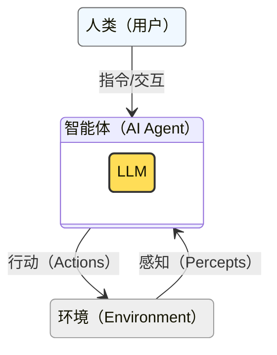

<!-- Copyright © 2026 Techunder (Guanhua Liu) | All Rights Reserved | https://techunder.tech | Email: techunder@163.com -->

AI Agent 简介

   原创
  发布时间：2026-04-13 | 更新时间：2026-04-14



**智能体**（AI Agent）作为日趋成熟的大语言模型（Large Language Model）的驾驭系统，正在以铺天盖地的态势重塑着整个软件行业。

伴随着大语言模型的日臻强大，智能体的技术也一直在变，从提示工程（Prompt Engineering）、上下文工程（Context Engineering）到驾驭工程（Harness Engineering），但变化之中，藏着不变的机理。

本系列文章从基础的角度梳理一下，对于 AI Agent，我们需要知道的知识，**会从那些不怎么变的核心原理说起，架起一座从传统软件思维到 AI 思维的桥梁**。

# 什么是智能体

智能体（AI Agent）的本质是**通过输入感知环境，然后利用算法或大语言模型（LLM）做推理和判断，最后以执行器对环境产生作用**。

最简单的场景是，你输入问题，它回答。

在整个交互循环中，人类是可选的，智能体本身可以自发地与环境互动。

对智能体来说，人类，其实也是环境的一部分。

> [!TIP]
> 智能体使用大语言模型做推理，导致其输入和输出**偏好人类自然语言**，是一个**文科生**

> AI 天生偏爱能够文本操作的工具，例如 CLI（命令行客户端）、Markdown、Mermaid Chart（文字描述画图）、各种编程语言

> [!TIP]
> 精通编程语言，便可调用各种接口，触达互联网上的任意资源，这意味着 AI Agent，只要被授权，便可接管整个世界

本系列拆分成两篇，分别是**大语言模型基础知识**和**智能体架构**

- [LLM，智力的源头](/docs/ai-agent-intro/1-llm/)

    人工智能 → 深度学习 → 大语言模型 → 上下文 → 工具调用 → LLM 接口

- [Agent，工程的起航](/docs/ai-agent-intro/2-agent/)

  OpenClaw 架构 → 分层架构 → 上下文实例 → 技能 → MCP → 记忆 → 会话

