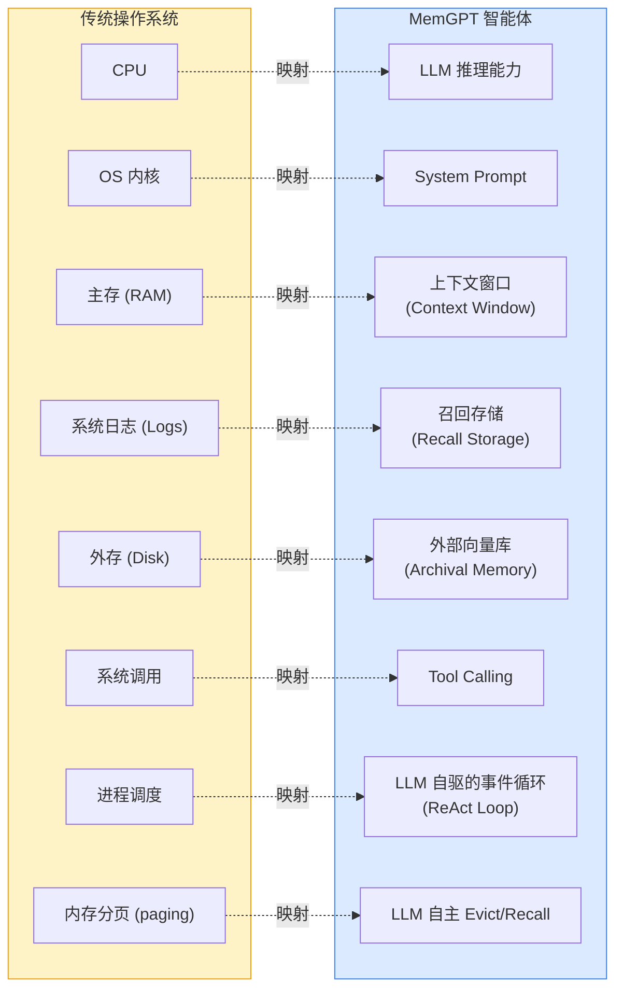
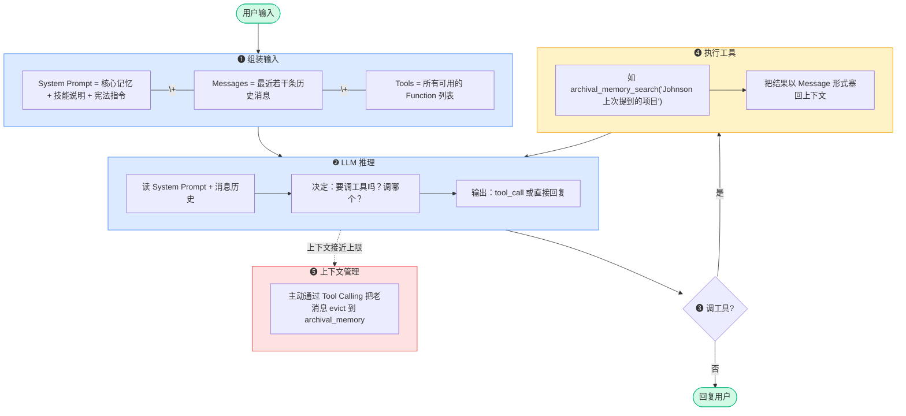

<!-- Copyright © 2026 Techunder (Guanhua Liu) | All Rights Reserved | https://techunder.tech | Email: techunder@163.com -->
<div class="page-title">AI Agent 记忆</div>
<div class="page-info">
   <span class="original-tag">整理</span>
  发布时间：2026-07-06 | 更新时间：2026-07-06
</div>


本文解读一篇 UC Berkeley 2023 年提出的给 LLM 做**分层长期记忆管理**的论文：

> 《*MemGPT: Towards LLMs as Operating Systems*》  
> by Charles Packer et al., UC Berkeley → ICLR 2024

# 一句话核心思想

**把 LLM 当作 CPU，把它的上下文窗口当作 RAM，把长期记忆当作磁盘——让 LLM 自己通过 "系统调用"（tool calling）来管理自己的多级记忆，像操作系统管理虚拟内存分页一样。**

---

# 它要解决什么问题

LLM 有一个根本矛盾：

**上下文窗口有限**（GPT-4 早期 8K/32K），模型受限于 Transformer 注意力 O(n²) 复杂度，而真实场景需求中，长期会话、用户偏好积累、海量文档分析等**需要"无限"记忆**，但利用 RAG 只能被动检索，**无法做到"主动压缩、主动关联、主动遗忘"**。

MemGPT 论文观察到：LLM 的瓶颈不是"知道什么"，而是"**同一时刻能看见什么**"。于是它借用了操作系统的经典解法——**分层内存 + 按需分页**。

---

# 核心类比：OS → LLM

这是论文的灵魂就建立在这张映射表上：



**关键洞察**：操作系统从来不要求"把整个磁盘内容常驻 RAM"——它按需分页。MemGPT 同样不要求"把全部历史塞进上下文"——LLM 自己决定何时把信息从 RAM 换出到磁盘、何时再换回来。

---

# 三层记忆架构

## ❶  Core Memory

核心记忆/主存

- **内容**：

  ```xml
  <persona>
    智能体自己是谁、能干什么、人格设定
  </persona>
  <user>
    关于用户的稳定信息（姓名、偏好、长期目标等）
  </user>
  ```

- **位置**：放在 system prompt 里，**每轮都直接喂给 LLM**
- **容量**：极小（受上下文限制），一般几 KB
- **访问**：`core_memory_append` / `core_memory_replace` / `core_memory_insert` 等工具
- **本质**：可以被 LLM "自我编辑" 的可读写主存，LLM 自己决定何时把某条用户偏好写进 user 块

## ❷  Recall Storage

召回存储/日志

- **内容**：所有 user/assistant 消息原文 + 时间戳
- **位置**：关系型数据库（SQLite 等）
- **容量**：无损保存全部原始消息
- **访问**：`conversation_search(query, start, end)` / `recall_memory_paginate(page)` 等工具
- **本质**：审计日志，LLM 可以按时间或关键词翻阅历史消息

## ❸  Archival Memory

档案记忆/外存

- **内容**：历史对话提取、过往事件、知识库等
- **位置**：外部向量数据库
- **容量**：理论上无限
- **访问**：`archival_memory_search(query)` / `archival_memory_insert(text)` 等工具
- **本质**：语义检索的长期仓库，LLM 主动 query 召回相关条目

---

# 工作原理：ReAct Loop

这是 MemGPT 的运行时机制。每次用户输入触发一次循环：



**🔑 核心创新：LLM 是自己的"记忆管理器"**：

- **传统 RAG**：开发者写代码决定何时记录什么、何时检索什么。  
- **MemGPT**：LLM 自己决定“需要保存该记忆到 Core Memory”、“现在该把这条信息从主存搬到外存了”、“现在该去外存查 X 了”。

底层依靠两件事：

- **System Prompt 里的"指令文档"**：告诉 LLM 所有工具的语义、何时该用。
- **Tool Calling 能力**：OpenAI 在 2023 年 6 月推出的结构化输出，让 LLM 可靠地“调用系统调用”。

---

# System Prompt 设计

论文里的 System Prompt 长这样（简化）：

```xml
<system>
  <persona>你是 MemGPT，是一个拥有分层记忆的智能体……</persona>
  <user>关于当前用户的稳定事实……</user>
  <instructions>
    ## 核心记忆操作
    - core_memory_append: 在指定字段后追加文本
    - core_memory_replace: 替换指定字段中的旧字符串
    - 用法：用户说"我搬家到上海" → 应触发 core_memory_replace
    ## 档案记忆操作
    - archival_memory_search: 语义检索长期记忆
    - archival_memory_insert: 写入长期记忆
    ## 召回存储操作
    - conversation_search: 按时间/关键词翻历史
    ## 上下文管理
    - 当用户问"上次我们说过 X"时，先 conversation_search
    - 当消息数 > N 时，主动 evict 旧消息
    ## 何时该用什么？
    - 一次性事实（如用户名字）→ core_memory
    - 长期参考信息 → archival_memory
    - 临时上下文 → 当前消息
  </instructions>
  <functions>...工具 JSON schema...</functions>
</system>
```

这个 **System Prompt 本身就是“操作系统内核的微缩版”**——它定义了 LLM 这个 CPU 能调用的所有“系统调用”。

---

# 两个演示场景

论文用了两类任务验证：

**场景 A：长期对话助手（Leta）**

- 跨多会话记住用户的研究兴趣、论文偏好、合作者
- 能在第 10 次会话中准确引用第 1 次会话提到的细节
- 效果：在 Locomo 长对话基准上超过纯 GPT-4 和传统 RAG

**场景 B：文档分析**

- 把整个文档（论文、小说）分块存入 archival
- 通过递归 search → read → search 实现"深入阅读"
- 解决 Transformer 的 "lost-in-the-middle" 问题（中间内容容易被忽略）
- 效果：在长文档 QA 上显著优于一次性塞进上下文的 baseline

---

# 与同类方案的对比

| 维度 | RAG | LangChain / Agents | MemGPT |
|------|-----|---------------------|------------|
| **记忆架构** | 单层（向量库） | 多样（开发者拼装） | 三层（主存/日志/外存） |
| **谁决定何时检索** | 开发者代码 | 开发者代码/简单 prompt | LLM 自主 |
| **谁决定何时遗忘** | 一般无机制 | 无机制 | LLM 自主 evict |
| **系统提示词** | 静态 | 静态 | 可被 LLM 自我编辑 |
| **长期一致性** | 弱（向量相似度漂移） | 中 | 强（核心记忆由 LLM 自己维护） |
| **复杂度** | 低 | 中 | 高（prompt 工程复杂、token 消耗大） |

**一句话区分：**

- **RAG = 数据库 + 检索器**（被动工具）
- **LangChain Agents = 工作流编排器**（流程胶水）
- **MemGPT = 给 LLM 装上操作系统内核**（让 LLM 成为自己的资源管理者）

---

# 局限与争议

论文也坦诚承认了一些问题：

- **强依赖 Tool Calling 能力**，2023 年早期模型不一定可靠
- **System Prompt 极度冗长**，每轮都要把所有指令 + 核心记忆塞进去，token 成本高
- **自我编辑的可控性**，LLM 误删核心记忆怎么办？需要校验/快照机制
- **评估困难**，长期记忆的好坏很难量化，论文里 Locomo 数据集规模有限
- **没解决根本问题**，上下文窗口的物理限制还在，MemGPT 只是把它"绕开"了

---

# 对工程师的核心启示

抛开论文本身的设计，MemGPT 给我们的方法论启示其实更深：

- **Context Window ≠ Memory**  
   别再把 LLM 当"无状态函数"。它有"工作记忆"和"长期记忆"两层。

- **让模型自己管理自己**  
   不要在外部代码里写死"何时检索"，而是给模型**足够的工具 + 清晰的指令**，让它自己判断。

- **System Prompt 是新的"内核"**  
   写得好的 System Prompt ≈ 一个微型操作系统。写得差的 ≈ 一坨 Prompt 堆叠。

- **Tool Calling 是新的"系统调用 ABI"**  
   工具的定义质量直接决定 LLM 能不能用好它们。

---

# 参考资料

- **论文原文**：[MemGPT: Towards LLMs as Operating Systems](https://arxiv.org/abs/2310.08560) (arXiv:2310.08560)
- **作者团队**：UC Berkeley Sky Computing Lab → 创立 [Letta](https://www.letta.com/) 公司
- **开源实现**：[letta-ai/letta](https://github.com/letta-ai/letta)（原 MemGPT 仓库已迁移）
- **关联论文**：Locomo（长对话记忆评估基准）
