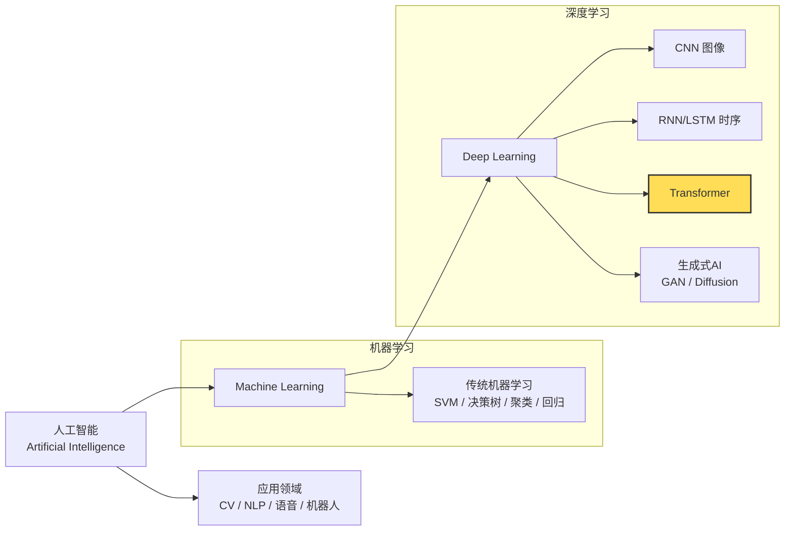

<!-- Copyright © 2026 Techunder (Guanhua Liu) | All Rights Reserved | https://techunder.tech | Email: techunder@163.com -->

关于LLM

   原创
  发布时间：2026-04-13 | 更新时间：2026-04-13



关于LLM我们需要知道的

# 人工智能

人工智能经过几十年的发展，已经形成一个庞大的分支。

（图：人工智能的主要分支）

当前是Tranformer架构在大放异彩。

# 神经网络
这是深度学习的主要方式，它模拟人类的大脑神经网络，通过神经元的连接权重和激活函数，把左边的输入转换成右边的输出，再选择概率高的作为最终结果。

（图：计算机深度神经网络）

> [!WARNING]
> 机器学习是建立在**概率论**之上的一门学科

# 大语言模型（LLM）
LLM是智能体的核心引擎和智力源泉。

现代的LLM基本是**Transformer架构**或其变体，始于Google Brain团队于2017年发表的一篇论文《Attention Is All You Need》。

（图：Transformer模型架构）

> [!NOTICE]
> 像GPT这一类主流生成大模型，只有右边的架构，输出是一个字一个字往外蹦（Decoder-only）



> [!NOTICE]
> 像BERT这一类理解模型，只有左边的架构，直接吐出整个语句的结果，用于分类或意图理解（Encoder-only）

Transformer是一种基于自注意力机制的深度神经网络架构，其核心模块通常采用**多头自注意力**结构。

通过投喂海量的通用知识，让其习得了其中的规律，并保存为模型的权重参数。
这个过程称为「**预训练**」（Pre-training）。

> [!TIP]
> 模型以人类自然语言为基础习得，权重参数量巨大，故名「**大语言模型**」

之后需要经过价值对齐、监督微调等的「**后训练**」（Post-training）过程才能上线使用。

# Token & Embedding

一段话先拆分成词元（token），例如

“我喜欢大自然” →「我」、「喜欢」、「大」、「自然」

每个token会被投射到embedding的向量空间中，语义相近的token距离较近。

  

（图：向量空间）

向量空间的维度通常较高，比如LLaMA-3 8B为4096维、OpenAI text-embedding-3-large默认3072维等

> [!TIP]
> 就像星星嵌在夜晚的天空中一样，我们按语义把token嵌入到一个高维向量空间中，故名 「**embedding**」（嵌入）

（图：embedding示意图）

> [!NOTICE]
> man ≈ 男人

> [!NOTICE]
> king - man + woman ≈ queen

对LLM的调用，通过输入和输出的token计费。

> [!WARNING]
> LLM以Token为计量单位，是AI时代像“电”一样的基本能源单位

# LLM 推理过程

1. 输入一句话 → 切成 token（词元）
2. 每个 token 变成 embedding 向量 → 得到一组 embedding 向量列表
3. 每个 embedding 向量都分别被映射成 Q、K、V 三个向量
4. 预测下一个字时，拿最后一个字的 Q，去跟前面所有字的 K 算相关性，相关性 = 权重
5. 用权重对前面所有 token 的 V 加权融合 → 得到单头注意力 output
6. 拼接多个单头注意力的 output → 映射回 embedding 向量列表
7. 最后输出映射：$d_{model}$ → $d_{vocab}$ → softmax → token 概率

# Context Length

上下文长度

# Tool Calling
