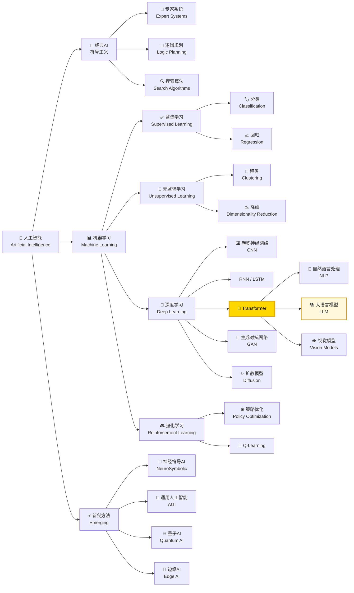

<!-- Copyright © 2026 Techunder (Guanhua Liu) | All Rights Reserved | https://techunder.tech | Email: techunder@163.com -->

<div class="page-title">关于 LLM，我们需要知道的</div>
<div class="page-info">
   <span class="original-tag">原创</span>
  发布时间：2026-04-14 | 更新时间：2026-04-14
</div>


要好用 AI Agent，我们需要先理解其核心，大语言模型（Large Language Model），简称 LLM

本文简要介绍，关于 LLM，我们需要知道的基础知识。

# 人工智能

人工智能经过几十年的发展，已经形成一系列庞大的分支



<center>（图：人工智能的主要分支）</center>

> 当前大放异彩的 LLM 就是属于 Tranformer 这一支

# 深度学习

深度学习是通过**深度神经网络**实现的，它模拟了人类的大脑神经网络结构。

<p>
  
  
</p>


<center>（图：计算机深度神经网络）</center>

深度神经网络由大量神经元组成，每层神经元接收前一层输出的**加权和**，经过**激活函数**实现非线性变换后传递给下一层，最终到达输出层。输出层根据任务类型给出相应形式的输出：
- **多分类任务**经 softmax 归一化为各类别的概率分布，推理时通常选择概率最高的类别作为预测结果；
- **二分类任务**经 sigmoid 输出 0 到 1 之间的标量值，可视为正类概率；
- **回归任务**则无激活函数，直接输出线性结果。

{}
### 加权求和+激活:
```katex
\boldsymbol{a}_{next} = \sigma(\boldsymbol{a}^T \boldsymbol{W} + \boldsymbol{b})
```
设按上一层 m 个神经元与当前层 n 个神经元**全连接**，其中
- $\boldsymbol{a}$ 为上一层的输出，shape 为 (m,1)
- $\boldsymbol{W}$ 为当前层的权重，shape 为 (m,n)
- $\boldsymbol{b}$ 为当前层的偏置，shape 为 (n,1)
- $\sigma$ 为激活函数，常见为：
    - $relu(x) = max(0, x)$，主流
    - $sigmoid(x) = \frac{1}{(1+e^{-x})}$，输出 0~1
    - $tanh(x) = \frac{e^x-e^{-x}}{e^x+e^{-x}}$，输出 -1~1

### softmax:
```katex
\text{softmax}(\boldsymbol{x}) = 
\begin{bmatrix} 
\text{softmax}(\boldsymbol{x})_1 \\ 
\text{softmax}(\boldsymbol{x})_2 \\ 
\cdots \\ 
\text{softmax}(\boldsymbol{x})_n 
\end{bmatrix}
```
其中 $\boldsymbol{x}$ 为向量
```katex
\text{softmax}(\boldsymbol{x})_i = \frac{e^{x_i}}{\sum_{j=1}^n e^{x_j}}
```
{}

一般的过程是通过训练得到权重 $\boldsymbol{W}$，封装成模型，再投放到应用场景中做推理。

不同的模型，会选择不同的架构，不同的权重参数量。

> [!TIP]
> 深度学习是建立在**概率论**之上的一门技术，对它来说，没有 100% 的必然 —— 每次输出只是当前条件下概率较高的 token，而非逻辑推导的必然结果。

> LLM 通常使用 temperature 或 top_p 调用参数来控制结果输出的采样策略

# 大语言模型

LLM 是智能体的核心引擎和智力源泉。

现代的 LLM 基本是 **Transformer 架构** 或其变体，始于 Google Brain 团队于 2017 年发表的一篇论文《Attention Is All You Need》。


<center>（图：Transformer 模型架构）</center>

> [!NOTICE]
> 像 GPT 这一类主流生成大模型，只有右边的架构（Decoder-only），输出是一个字一个字往外蹦的

> [!NOTICE]
> 像 BERT 这一类理解模型，只有左边的架构（Encoder-only），可以直接吐出整个语句的结果，用于分类或意图理解

Transformer 是一种基于自注意力机制的深度神经网络架构，其核心模块通常采用**多头自注意力**结构。

通过投喂海量的通用知识，让其习得了其中的规律，并保存为模型的权重参数，这个过程称为**预训练**（Pre-training）。

> [!TIP]
> 模型以人类自然语言为基础习得，且权重参数量巨大，故名**大语言模型**

之后需要经过价值对齐、监督微调等的**后训练**（Post-training）过程才能上线使用。

# LLM 推理过程

使用过程中，让 LLM 生成内容的过程成为**推理**（inference），大语言模型推理过程是这样的：

`把输入切分成 token → 把 token 转换成 embedding 向量 → 输入大语言模型做推理 → 逐个输出 token`



例如 “我喜欢大自然” 会被拆分成 「我」、「喜欢」、「大」、「自然」 这四个 token。

人类自然语言里所有 token（词元）会组成一个**词库**。

词库里的每一个 token 都可以通过 **embedding model**（嵌入模型）生成对应的高维 embedding 向量。

生成的 embedding 向量不是随意的，是对人类自然语言进行大量学习后摸索出的规律，使得语义相关高的 token 向量值也比较类似。

> [!WARNING]
> embedding model ≠ LLM

不同的企业或开源社区，都可以训练出自己的 embedding model。

不同的 embedding model 的向量维度可以不一样。

> 例如 `paraphrase-multilingual-MiniLM-L12-v2` embedding model 的维度为 384。

有几个有意思的 embedding 例子：

> man ≈ 男人

> 美丽 ≈ 漂亮

> king - man + woman ≈ queen

想更深入了解 embedding 的知识，青看这篇文档：[embedding](/docs/embedding/)

对 LLM 的调用，通过输入和输出的 token 计费。

> [!TIP]
> LLM 以 token 为计量单位，token 是 AI 时代像“电”一样的存在，都为能源消耗基础单位，需要消耗 token 得到结果

# Context Length

上下文长度

# Tool Calling

