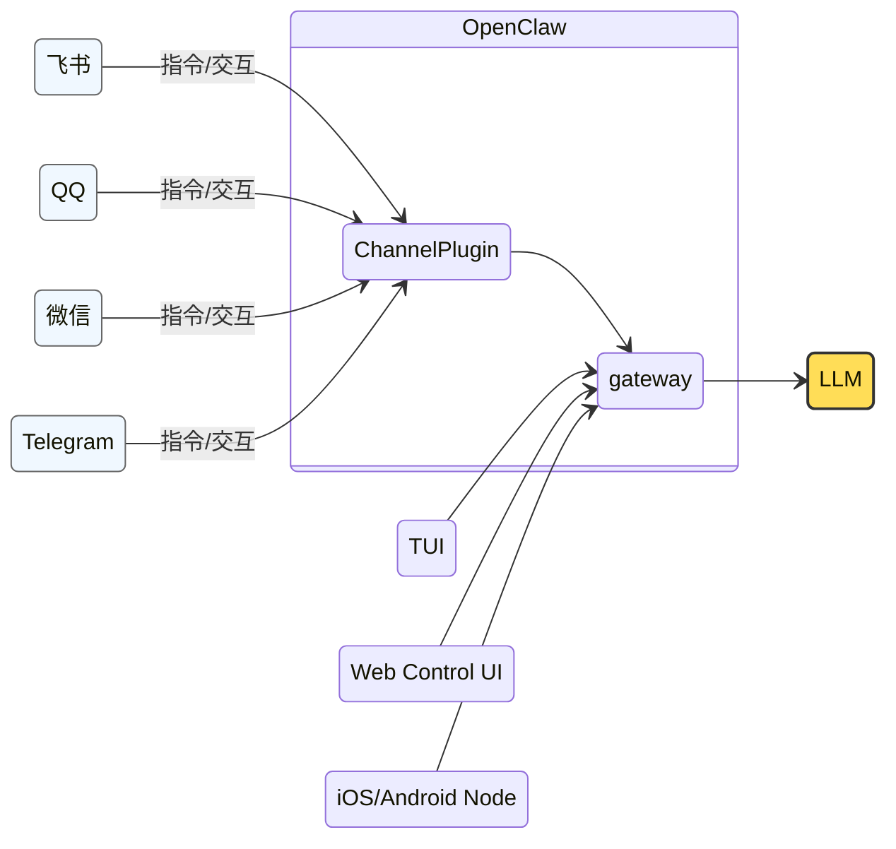
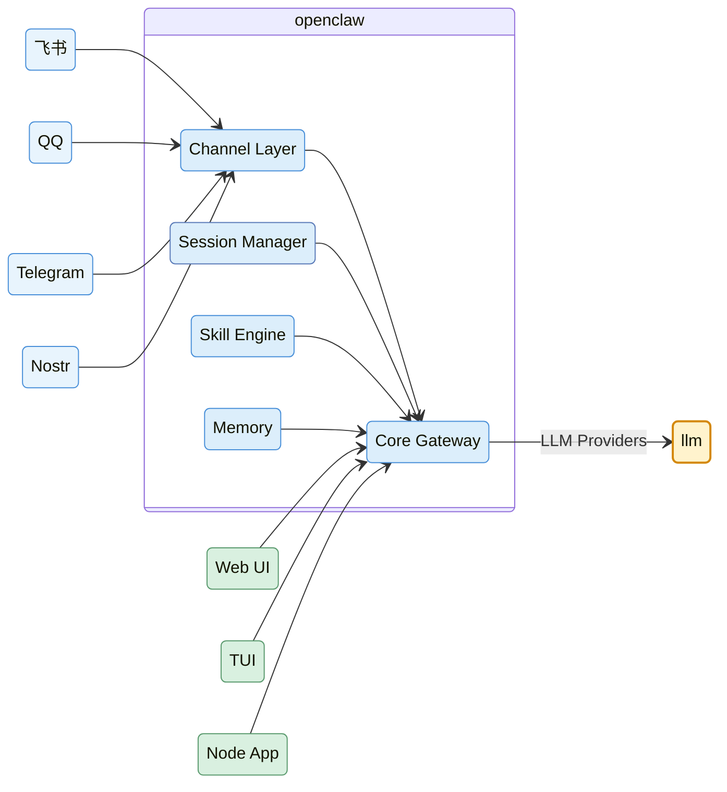

<!-- Copyright © 2026 Techunder (Guanhua Liu) | All Rights Reserved | https://techunder.tech | Email: techunder@163.com -->

Agent，工程的起航

   原创
  发布时间：2026-04-16 | 更新时间：2026-04-17



有了前面的基础知识铺垫，终于来到了 LLM 的实践应用话题。

**智能体**（AI Agent）是 LLM 的落地应用。随着 AI Agent 工程化的成熟，业界已经发展出一套最佳实践。

本文按这套实践展开，来讲讲于 AI Agent 工作的核心逻辑，过程会以当下非常火爆的个人智能体 [OpenClaw](https://github.com/openclaw/openclaw) 作为例子展开。

# 分层架构

AI Agent 是一个由软硬件组成的复杂系统，按我个人的理解，拆分如下分层架构：

<table>
  <tr><th>层级</th><th>名称</th><th>说明</th></tr>
  <tr style="background:#FFFFFF"><td>8</td><td>👤 用户层</td><td>需求·权限·审计</td></tr>
  <tr style="background:#E8F5E9"><td>7</td><td>📖 技能层</td><td>工具使用说明和技巧手册（skill.md），AI 时代的 App</td></tr>
  <tr style="background:#F0F8FF"><td>6</td><td>🔧 工具层</td><td>命令·接口·MCP，智能体的武器库</td></tr>
  <tr style="background:#FFFBE0"><td>5</td><td>⚙️  智能体层</td><td>LLM 驾驭系统，AI 时代的 OS（Claude Code, Codex, OpenClaw）</td></tr>
  <tr style="background:#FFFDE7"><td>4</td><td>🧠 模型层</td><td>智能引擎，AI 时代的发动机（OpenAI, Anthropic, Google）</td></tr>
  <tr style="background:#F8F8F8"><td>3</td><td>🖥️ 基础设施层</td><td>服务器·存储·网络（AWS, Azure, 阿里云）</td></tr>
  <tr style="background:#F8F8F8"><td>2</td><td>💻 芯片层</td><td>GPU·TPU（英伟达 Nvidia，Google）</td></tr>
  <tr style="background:#F8F8F8"><td>1</td><td>⚡ 能源层</td><td>超大型 AI 数据中心年耗电量相当于中等城市的居民年用电量</td></tr>
</table>

为了方便后面举例，这里也把 OpenClaw 的架构简要描述一下：

# 会话

前文[上下文长度](/docs/ai-agent/1-llm/#%E4%B8%8A%E4%B8%8B%E6%96%87%E9%95%BF%E5%BA%A6)中，我们提到了每一个 LLM 都是有上下文限制。

每一轮的对话，都会附加到一个对话列表中，整个对话列表就组成一个**会话**（session）。

Session 终有到达模型上下文长度上限的时候，所以 Session 是有生命周期的。

Session 的状态可以分为：

- Running：活跃状态，随时可以接着继续聊
- Stopped：已归档，保留一段时间
- Deleted：已删除，释放存储空间

因为 session 只是多轮对话的集合，所以是可以同时开启多个活跃状态的 session。

> 以 OpenClaw 来举例，每一个 channel （飞书、QQ、微信）的每一个 Agent 都会对应一个活跃状态的 Agent。

# 提示词

constitution + memory + skills + tools

# 记忆

# 技能

技能（skill）

# 工具

tool

MCP

# 生态协议

- **LSP**: Language Server Protocol [JSON-RPC 2.0] (https://microsoft.github.io/language-server-protocol/)
- **MCP**: Model Context Protocol [JSON-RPC 2.0] (https://modelcontextprotocol.io/)
- **ACP**: Agent Communication Protocol [JSON-RPC 2.0] (https://agentcommunicationprotocol.dev/) 
- **ACP**: Agent Client Protocol (https://agentclientprotocol.com)

# 结语

关于 OpenClaw，我是如何部署的，都用来干什么
