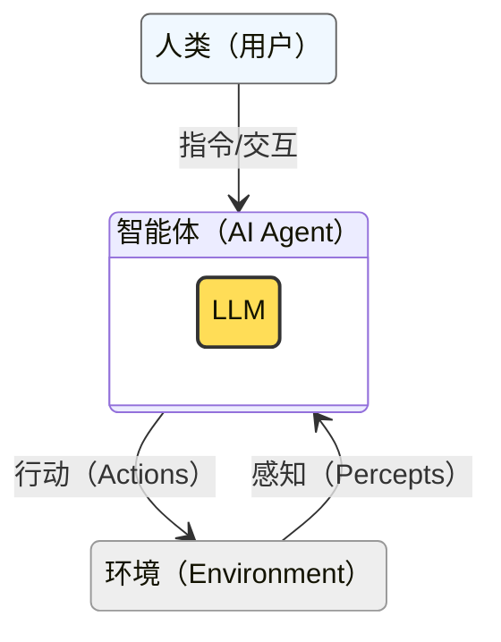

<!-- Copyright © 2026 Techunder (Guanhua Liu) | All Rights Reserved | https://techunder.tech | Email: techunder@163.com -->

AI Agent概述

   原创
  发布时间：2026-04-13 | 更新时间：2026-04-13



**智能体**（AI Agent）作为日趋成熟的大语言模型（Large Language Model）的驾驭系统，正在以铺天盖地的态势重塑着整个软件行业。

伴随着大语言模型的日臻强大，智能体的技术也一直在变，从提示工程（Prompt Engineering）、上下文工程（Context Engineering）到驾驭工程（Harness Engineering），但变化之中，藏着不变的核心原理。

本文想从基础层面梳理一下，**从那些不怎么变的核心原理说起，架起从传统软件思维到智能体思维的桥梁**。

# 什么是智能体
智能体（AI Agent）的本质是通过输入感知环境，然后通过算法或大语言模型（LLM）做判断和推理，最后通过执行器对环境产生作用。

最简单的场景是，你输入问题，它回答。

在整个交互循环中，人类其实是可选的，智能体本身可以自发和环境互动。

**对智能体来说，人类，其实是环境的一部分。**

> [!WARNING]
> 智能体使用大语言模型做推理，导致其输入和输入出，**偏好人类自然语言**
