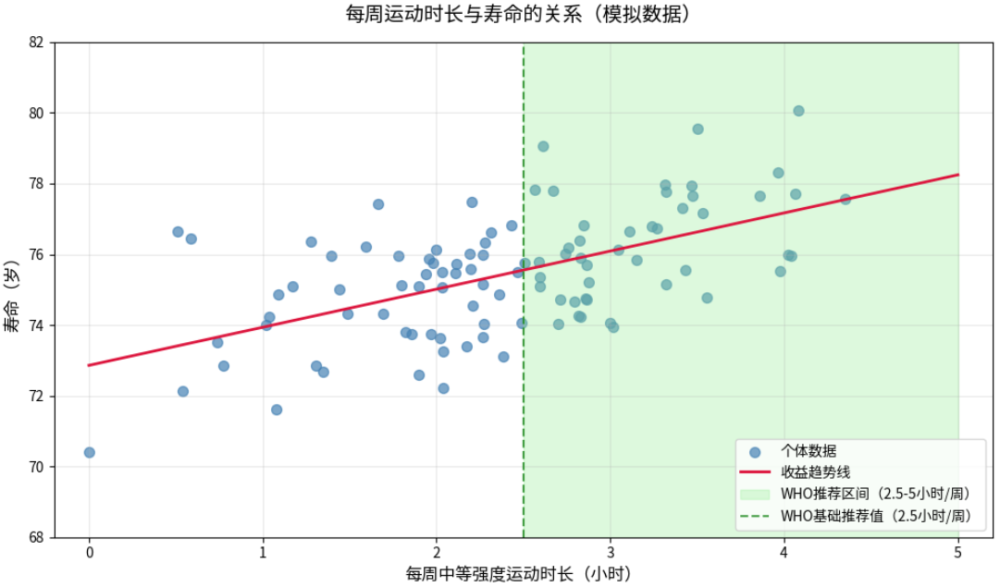

<!-- Copyright © 2026 Techunder (Guanhua Liu) | All Rights Reserved | https://techunder.tech | Email: techunder@163.com -->

<div class="page-title">线性回归模型</div>
<div class="page-info">
   <span class="original-tag">原创</span>
  发布时间：2026-01-28 | 更新时间：2026-01-29
</div>

人工智能的核心基石是机器学习，而机器学习的底层逻辑则根植于数学原理。深入拆解线性回归这一经典模型，既能让你领略数学的简洁之美，也能让你体会梯度下降算法的工程实践魅力。本文将以寿命预测线性回归模型为案例，带你系统探究线性回归模型的核心原理与实现思路。

# 什么是线性模型
---
我们都知道，人的寿命受很多因素的影响。例如：

- 遗传基因：遗传基因是影响寿命的最基本因素。
- 环境因素：天气、生活环境、压力环境等。
- 个人因素：年龄、性别、体重、运动时间、饮食习惯等。

既然寿命与这些因素相关，我们就可以使用**线性回归**模型，通过各种因素预测寿命。
线性回归模型是朴素而最强大的工具，可以帮我们发现潜藏于大量数据下各个因素相对目标变量的线性规律。

## 一元线性回归模型
先看一个最简单的问题：每周运动时间和预期寿命的关系。

假设我们统计了200个人的每周运动时长和最终寿命，把数据画成散点图：横轴是每周运动小时数，纵轴是寿命。我们发现一个模糊但明显的趋势 —— 运动时间越长的人，寿命大概率也越长。

> 世界卫生组织（WHO）推荐的成人每周运动时长为中等强度2.5\~5小时，或高强度1.25\~2.5小时，额外搭配2次力量训练（适用于18\~64岁成年人）。



{}
```python
import numpy as np
```
{}


> [!TIP]
> 线性回归要做的，就是在这些散点中，画一条最贴合的直线，即找到运动时长与寿命的关系。

这条直线的方程可以写成：
```katex
\hat{y} = wx + b
```
其中
- $\hat{y}$：预期寿命；
- $x$：每周运动小时数；
- $w$：权重系数（weight），代表运动时长对寿命的影响程度，值越大，说明运动对寿命的提升作用越明显；
- $b$：截距项（bias），可以理解为基础寿命值，哪怕一个人完全不运动，也能拥有的寿命基数。

$w$和$b$是线性回归模型要学习的参数，有了这两个参数值，就可以通过每周运动时长预测一个人的预期寿命。这个方程就是一句大白话：基础寿命，加上运动带来的增益，就是预期寿命。

当影响因素变多，比如遗传、饮食、吸烟等，线性回归也能轻松应对，只需要为每个影响因素分配对应的权重，然后把它们的影响加起来就行，这就是多元线性回归。

## 多元线性回归模型
参考《Nature》、《柳叶刀》等顶刊的研究结论，筛选出7个影响寿命的因素：

| 影响因素 | 英文名| 数学变量 | 量化方式 |
|----------|----------|----------|----------|
| 父母平均寿命 | parent_lifespan | $x_1$ | 连续变量（岁），比如父母平均寿命75岁 |
| 性别 | gender | $x_2$ | 分类变量（0=男性，1=女性） |
| 每周中等强度运动时长 | exercise_hours | $x_3$ | 连续变量（小时），范围0~10小时 |
| 是否长期吸烟 | smoking | $x_4$ | 分类变量：0=不吸烟，1=长期吸烟 |
| 饮食健康程度 | diet_health | $x_5$ | 分类变量：0=高油高糖高盐，1=低脂低糖低盐 |
| 每日睡眠时长 | sleep_hours | $x_6$ | 连续变量（小时），范围5~9小时 |
| 压力/心理健康水平 | stress_level |	$x_7$ | 分类变量：0=长期高压，1=压力适中，2=低压力/社交支持充足 |

上面的因素称为**特征**，是模型的自变量，因变量为预期寿命（actual_lifespan） $\hat{y}$：

```katex
\hat{y} = b + w_1 x_1 + w_2 x_2 + w_3 x_3 + w_4 x_4 + w_5 x_5 + w_6 x_6 + w_7 x_7
```
把特征前面加个常数1，按向量的方式表示为（$1 \times 8$）：
```katex
\boldsymbol{x} = [1, x_1, x_2, x_3, x_4, x_5, x_6, x_7]
```
权重参数表示为（$8 \times 1$）：
```katex
\boldsymbol{w} = \begin{bmatrix} b \\ w_1 \\ w_2 \\ w_3 \\ w_4 \\ w_5 \\ w_6 \\ w_7 \end{bmatrix}
```
那么，模型的预测值就可以写成矩阵相乘的形式：
```katex
\hat{y} = \boldsymbol{x} \boldsymbol{w}
```

> 矩阵($1 \times 8$)与矩阵($8 \times 1$)相乘得到一个($1 \times 1$)的标量，也就是预期寿命$\hat{y}$。

> [!TIP]
> $\boldsymbol{w}$ 就是我们想求解的权重系数，也叫模型参数，通过训练数据由计算机自动计算出来。

弄清楚了线性回归模型的概念，接下来我们看看一个完整例子，并逐步讲解求解过程。

# 一个完整的求解过程

## 问题描述
假设我们通过对1000人进行了长期跟踪与统计，得到一份包含寿命影响因素和最终寿命的数据集（模拟生成，字段见[多元线性回归模型](#多元线性回归模型)）：

点击下载数据集 (.csv)
{}
```python
```
{}

数据集的前5行如下：
| 序号 | parent_lifespan | gender | exercise_hours | smoking | diet_health | sleep_hours | stress_level | actual_lifespan |
|------|-----------------|--------|----------------|---------|-------------|-------------|--------------|-----------------|
| 1    | 77.5            | 0      | 7.2            | 0       | 0           | 7.1         | 0            | 56.0            |
| 2    | 74.3            | 1      | 0.7            | 1       | 0           | 5.4         | 2            | 47.0            |
| 3    | 78.2            | 0      | 0.7            | 1       | 0           | 5.7         | 1            | 43.0            |
| 4    | 82.6            | 1      | 0.1            | 1       | 1           | 7.3         | 1            | 61.0            |
| 5    | 73.8            | 0      | 9.6            | 1       | 1           | 6.2         | 2            | 62.0            |

拿到这个数据集后，我们决定使用线性回归模型来表示特征与寿命的关系。我们已经知道了模型公式$\hat{y} = \boldsymbol{w} \boldsymbol{x}$，接下来可以开始求解模型的权重系数了。

有两种方法，一种是**解析解**求解，是以纯数学的方式求解答案；另一种是**梯度下降**法求解，以工程化的方式通过迭代来不断逼近最优解。

## 解析解
我们先来当一回数学家，用解析解求解模型的权重系数，这是本文最烧脑的地方，需要做一些矩阵的运算，但一旦弄懂了，将会受益无穷。

我们先对变量做一下定义：

-----todo

- $\boldsymbol{w}$：权重系数向量（$8 \times 1$），包含截距项$b$和$w_1$到$w_7$共8个系数。
- $\boldsymbol{X}$：特征矩阵（$1000 \times 8$），包含1000行样本，8列特征（包括截距项$x_0=1$）。
- $\boldsymbol{y}$：实际寿命向量（$1000 \times 1$），包含1000个样本的实际寿命值。

因为我们的模型公式是：
```katex
\hat{y} = \boldsymbol{w}^T \boldsymbol{x}
```
我们可以将其写成矩阵形式：
```katex
\hat{y} = X w
```
这为通过未知数$w$计算出来的预期寿命$\hat{y}$，但和真实的实际寿命$y$之间存在误差。我们的目标是通过最小化这个误差来求解最优的权重系数$w$。

误差通过均方误差（MSE）来计算：
```katex
MSE = \frac{1}{n} \sum_{i=1}^{n} (y_i - \hat{y}_i)^2
```

下一步，我们要解出权重系数$w$。根据线性回归的数学模型，我们可以得到解析解的公式：
```katex
w = (X^T X)^{-1} X^T y
```

接下来，可以开始通过Python代码实现解析解求解模型的权重系数了。代码如下
```python
import numpy as np

# 读取数据集
data = np.genfromtxt('lifespan_data_full.csv', delimiter=',', skip_header=1)

# 提取特征和目标变量
X = data[:, :-1]  # 所有列 кроме最后一列
y = data[:, -1]   # 最后一列

# 添加截距项
X = np.column_stack((np.ones(len(X)), X))

# 计算权重系数
w = np.linalg.inv(X.T @ X) @ X.T @ y

print("权重系数:", w)
```

## 梯度下降法

## 模型预测验证（推理）
所谓推理就是把前面学习到的模型用于对未知数据的预判

# 后话

## 哪种求解方法更优？
解析解求解方法更优，因为它直接给出了最优解，而梯度下降法需要迭代优化，可能会收敛到局部最优解。但梯度下降法的优势在于它可以处理大规模数据集，而解析解求解方法在数据集较大时会变得非常复杂。且当数据集包含噪声或异常值时，梯度下降法更稳定。