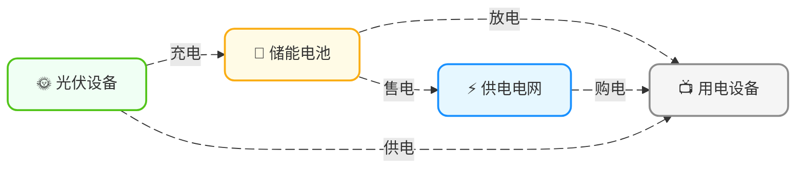
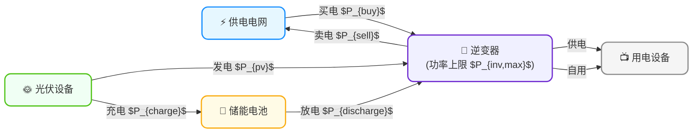

<!-- Copyright © 2026 Techunder (Guanhua Liu) | All Rights Reserved | https://techunder.tech | Email: techunder@163.com -->
<div class="page-title">家庭节能示例</div>
<div class="page-info">
   <span class="original-tag">原创</span>
  发布时间：2026-05-13 | 更新时间：2026-05-13
</div>


# 系统架构

家庭每天的电，

**来源**就三种：
1. 电网购电（电力公司卖的）
2. 光伏发电（太阳给的）
3. 电池放电（自己存起来的）

**去向**也对应三种：
1. 家里用掉（各种电器）
2. 存进电池（先存着以后用）
3. 卖给电网（多余的电卖掉）

能源流动图：



加上逆变器后的架构图：


# 参数变量

以**每个时间步 t**（例如 15 分钟或 1 小时）为单位，定义各种参数变量。

## 参数（Parameters）

这些是需要提前收集或预测的变量值

| 参数             | 含义                 | 典型值/来源              |
| ---------------- | -------------------- | ------------------------ |
| $P_{pv,t}$       | 光伏发电功率	      | 预测模型输出，单位：kW   |
| $L_{rigid,t}$    | 刚性负荷功率	      | 预测模型输出，单位：kW   |
| $\pi_{buy,t}$    | 分时电价（买）	      | 电网定价，单位：元/kWh   |
| $\pi_{sell,t}$   | 分时电价（卖）	      | 上网电价，单位：元/kWh   |
| $C_{cycle}$      | 电池循环成本	      | 约 0.1-0.5，单位：元/kWh |
| $P_{inv,max}$	   | 逆变器功率上限       |	约 5-10，单位：kW        |
| $C_{batt}$	   | 电池总容量           | 约10-20，单位：kWh       |

## 决策变量（Decision Variables）

这些是模型需要求解的变量

| 变量             | 含义                 | 单位 | 取值范围           |
| ---------------- | -------------------- | ---- | ------------------ |
| $P_{buy,t}$      | 从电网购电功率       | kW   | $\ge 0$            |
| $P_{sell,t}$     | 向电网售电功率       | kW   | $\ge 0$            |
| $P_{charge,t}$   | 电池充电功率         | kW   | $[0, P_{inv,max}]$ |
| $P_{discharge,t}$| 电池放电功率         | kW   | $[0, P_{inv,max}]$ |
| $SOC_t$          | 电池荷电状态         | kWh  | $[0.1 \cdot C_{batt}, 0.9 \cdot C_{batt}]$ |

## 导出变量（Derived Variables）


# 目标函数
**经济性导向**（最小化电费）：
```katex
\min \sum_{t=1}^{T} \left( P_{buy,t} \cdot \pi_{buy,t} - P_{sell,t} \cdot \pi_{sell,t} + C_{cycle} \cdot (P_{charge,t} + P_{discharge,t}) \right) 
```

其中：
- $\pi_{buy,t}$ / $\pi_{sell,t}$ — 分时电价（峰/谷/平）
- $C_{cycle}$ — 电池循环损耗成本（元/kWh）

# 约束条件
**1. 功率平衡：** 
```katex
P_{pv,t} + P_{buy,t} + P_{discharge,t} = L_{rigid,t} + P_{shift,t} + P_{charge,t} + P_{sell,t}
```

**2. 电池SOC动态：** 
```katex
SOC_t = SOC_{t-1} \cdot (1 - \sigma) + \eta_{charge} \cdot P_{charge,t} - \frac{P_{discharge,t}}{\eta_{discharge}} 
```
其中 $\sigma$ 是自放电率，$\eta$ 是充放电效率

**3. 电池容量约束：** 
```katex
SOC_{min} \le SOC_t \le SOC_{max} \quad (\text{比如 } 10\% \sim 90\%)
```

**4. 逆变器功率约束：** 
```katex
P_{charge,t} \le P_{inv,max}, \quad P_{discharge,t} \le P_{inv,max} 
```

**5. 并网功率约束：** 
```katex
P_{buy,t} \le P_{grid,max}, \quad P_{sell,t} \le P_{grid,max} 
```

**6. 可平移负荷时间窗（可选）：** 
```katex
\sum_{t \in \mathcal{W}_k} P_{shift,t} = E_k \quad \forall \text{ 设备 } k 
```

其中 $E_k$ 是设备总用电量，$\mathcal{W}_k$ 是允许运行的时间窗口
