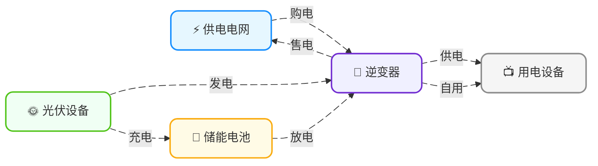

<!-- Copyright © 2026 Techunder (Guanhua Liu) | All Rights Reserved | https://techunder.tech | Email: techunder@163.com -->
<div class="page-title">综合示例</div>
<div class="page-info">
   <span class="original-tag">原创</span>
  发布时间：2026-05-13 | 更新时间：2026-05-14
</div>


本文以一个有光伏发电设备和储能设备的家庭的经济用电为例子，讲一下线性规划的应用。

# 系统架构

家庭每天的电，

**来源**就三种：
1. 电网购电（电力公司卖的）
2. 光伏发电（太阳给的）
3. 电池放电（自己存起来的）

**去向**也对应三种：
1. 家里用掉（各种电器）
2. 存进电池（先存着以后用）
3. 卖给电网（多余的电卖掉）

能量流动图：


加上逆变器后的部署图：


# 参数变量

以**每个时间步 $\Delta t$**（例如 15 分钟或 1 小时）为单位，定义各种参数与变量。

## 参数

参数（Parameters）是需要提前收集或预测的变量值

| 参数             | 含义                  | 典型值/来源              |
| ---------------- | --------------------- | ------------------------ |
| $P_{pv,t}$       | 光伏发电功率	       | 预测模型输出，单位：kW   |
| $P_{rigid,t}$    | 刚性负荷功率	       | 预测模型输出，单位：kW   |
| $\pi_{buy,t}$    | 峰/谷/平分时电价（买）| 电网定价，单位：元/kWh   |
| $\pi_{sell,t}$   | 峰/谷/平分时电价（卖）| 上网电价，单位：元/kWh   |
| $C_{cycle}$      | 电池循环成本	       | 约 0.1-0.5，单位：元/kWh |
| $P_{inv,max}$	   | 逆变器功率上限        | 约 5-10，单位：kW        |
| $P_{grid,max}$   | 并网功率上限	       | 约 5-10，单位：kW        |
| $C_{batt}$	   | 电池总容量            | 约10-20，单位：kWh       |
| $SOC_{min}$	   | 电池荷电下限	       | 0.10（即 10% DOD（Depth of Discharge））|
| $SOC_{max}$	   | 电池荷电上限	       | 0.90（即 90% DOD（Depth of Discharge））|
| $\Delta t$	   | 时间步长	           | 0.25 h（15分钟）或 1 h   |
| $T$	           | 优化时域的总时段数	   | 96（1 天，0.25 h 步长）或 24（1 天，1 h 步长）|
| $SOC_{init}$     | 电池初始容量          | BMS 实时读取             |

## 决策变量

决策变量（Decision Variables）是模型需要求解的变量

| 决策变量          | 含义                 | 单位 | 取值范围           |
| ----------------- | -------------------- | ---- | ------------------ |
| $P_{buy,t}$       | 从电网购电功率       | kW   | $\ge 0$            |
| $P_{sell,t}$      | 向电网售电功率       | kW   | $\ge 0$            |
| $P_{charge,t}$    | 电池充电功率         | kW   | $[0, P_{inv,max}]$ |
| $P_{discharge,t}$ | 电池放电功率         | kW   | $[0, P_{inv,max}]$ |
| $SOC_t$           | 电池荷电状态         | kWh  | $[SOC_{min} \cdot C_{batt}, SOC_{max} \cdot C_{batt}]$ |

# 目标函数

按**经济性导向**，即最小化电费来设计目标函数。

影响电费的因素是以下三个：
- 购电电费（+）
- 售电电费（-）
- 电池循环成本（+）

最终得出如下目标函数（按T为单位计算电费，通常是1天）：

```katex
\min \sum_{t=1}^{T} \left( P_{buy,t} \cdot \pi_{buy,t} - P_{sell,t} \cdot \pi_{sell,t} + C_{cycle} \cdot P_{discharge,t} \right) \cdot \Delta t
```

# 约束条件

## 功率平衡

输入的功率必须等于输出的功率

```katex
P_{pv,t} + P_{buy,t} + P_{discharge,t} = P_{rigid,t} + P_{charge,t} + P_{sell,t} \quad \forall t \in \{1, \dots, T\}
```

> 做了简化：无能量损耗

## 电池 SOC 动态

```katex
SOC_t = SOC_{t-1} + (P_{charge,t} - P_{discharge,t}) \cdot \Delta t \quad \forall t \in \{1, \dots, T\}
```

> 做了简化：无自放电、无效率损耗

## 电池 SOC 边界

```katex
SOC_{min} \cdot C_{batt} \leq SOC_t \leq SOC_{max} \cdot C_{batt} \quad \forall t \in \{1, \dots, T\}
```

## 电池初始 SOC

```katex
SOC_0 = SOC_{init}
```

## 逆变器功率限制

电池充电功率不能高于逆变器功率上限

```katex
0 \leq P_{charge,t} \leq P_{inv,max} \quad \forall t \in \{1, \dots, T\}
```

电池放电功率不能高于逆变器功率上限

```katex
0 \leq P_{discharge,t} \leq P_{inv,max} \quad \forall t \in \{1, \dots, T\}
```

## 并网功率限制

购电功率不能高于并网功率上限

```katex
0 \leq P_{buy,t} \leq P_{grid,max} \quad \forall t \in \{1, \dots, T\}
```

售电功率不能高于并网功率上限

```katex
0 \leq P_{sell,t} \leq P_{grid,max} \quad \forall t \in \{1, \dots, T\}
```

# 代码实现

我们选用 `CVXPY` 这个框架

```python

```
