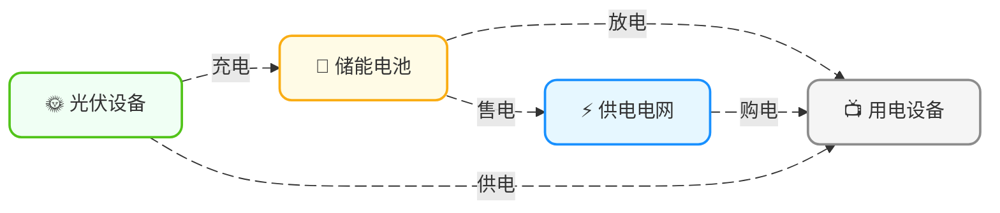

<!-- Copyright © 2026 Techunder (Guanhua Liu) | All Rights Reserved | https://techunder.tech | Email: techunder@163.com -->
<div class="page-title">家庭能源优化</div>
<div class="page-info">
   <span class="original-tag">原创</span>
  发布时间：2026-05-13 | 更新时间：2026-05-14
</div>


本文以一个有光伏发电设备和储能设备的家庭能源优化为例子，讲一下线性规划的应用。

# 系统架构

家庭每天的电，

**来源**就三种：
1. 电网购电（电力公司卖的）
2. 光伏发电（太阳给的）
3. 电池放电（自己存起来的）

**去向**也对应三种：
1. 家里用掉（各种电器）
2. 存进电池（先存着以后用）
3. 卖给电网（多余的电卖掉）

能量流动图：



加上逆变器后的部署图：


# 参数变量

以**每个时间步 $\Delta t$**（例如 15 分钟或 1 小时）为单位，定义各种参数与变量。

## 参数

参数（Parameters）是需要提前收集或预测的变量值

| 参数             | 含义                  | 典型值/来源              |
| ---------------- | --------------------- | ------------------------ |
| $P_{pv,t}$       | 光伏发电功率	       | 预测模型输出，单位：kW   |
| $P_{rigid,t}$    | 刚性负荷功率	       | 预测模型输出，单位：kW   |
| $P_{grid,max}$   | 并网功率上限	       | 约 5-10，单位：kW        |
| $P_{inv,max}$	   | 逆变器功率上限        | 约 5-10，单位：kW        |
| $\pi_{buy,t}$    | 峰/谷/平分时电价（买）| 电网定价，单位：元/kWh   |
| $\pi_{sell,t}$   | 峰/谷/平分时电价（卖）| 上网电价，单位：元/kWh   |
| $C_{batt}$	   | 电池总容量            | 约 10-20，单位：kWh      |
| $SOC_{init}$     | 电池初始容量          | BMS 实时读取，单位：kWh  |
| $SOC_{min}$	   | 电池荷电下限	       | 0.10，即 10% DOD（Depth of Discharge）|
| $SOC_{max}$	   | 电池荷电上限	       | 0.90，即 90% DOD（Depth of Discharge）|
| $C_{cycle}$      | 电池循环成本	       | 约 0.1-0.5，单位：元/kWh |
| $\Delta t$	   | 时间步长	           | 0.25 h（15分钟）或 1 h   |
| $T$	           | 优化时域的总时段数	   | 96（1 天，0.25 h 步长）或 24（1 天，1 h 步长）|

## 决策变量

决策变量（Decision Variables）是模型需要求解的变量

| 决策变量          | 含义                 | 单位 | 取值范围           |
| ----------------- | -------------------- | ---- | ------------------ |
| $P_{buy,t}$       | 从电网购电功率       | kW   | $\ge 0$            |
| $P_{sell,t}$      | 向电网售电功率       | kW   | $\ge 0$            |
| $P_{charge,t}$    | 电池充电功率         | kW   | $[0, P_{inv,max}]$ |
| $P_{discharge,t}$ | 电池放电功率         | kW   | $[0, P_{inv,max}]$ |
| $SOC_t$           | 电池荷电状态         | kWh  | $[SOC_{min} \cdot C_{batt}, SOC_{max} \cdot C_{batt}]$ |

# 目标函数

按**经济性导向**，即最小化电费来设计目标函数。

影响电费的因素主要是以下三个：
- 购电电费（+）
- 售电电费（-）
- 电池循环成本（+）

最终得出如下目标函数（按T为单位计算电费，通常是1天）：

```katex
\min \sum_{t=1}^{T} \left( P_{buy,t} \cdot \pi_{buy,t} - P_{sell,t} \cdot \pi_{sell,t} + C_{cycle} \cdot P_{discharge,t} \right) \cdot \Delta t
```

# 约束条件

## 电池初始 SOC

```katex
SOC_0 = SOC_{init}
```

## 功率平衡

输入的功率必须等于输出的功率

```katex
P_{pv,t} + P_{buy,t} + P_{discharge,t} = P_{rigid,t} + P_{charge,t} + P_{sell,t} \quad \forall t \in \{1, \dots, T\}
```

> 做了简化：无能量损耗、用电全部计为刚需负荷

## 电池 SOC 动态

```katex
SOC_t = SOC_{t-1} + (P_{charge,t} - P_{discharge,t}) \cdot \Delta t \quad \forall t \in \{1, \dots, T\}
```

> 做了简化：无自放电、无效率损耗

## 电池 SOC 边界

```katex
SOC_{min} \cdot C_{batt} \leq SOC_t \leq SOC_{max} \cdot C_{batt} \quad \forall t \in \{1, \dots, T\}
```

## 逆变器功率限制

电池充电功率不能高于逆变器功率上限

```katex
0 \leq P_{charge,t} \leq P_{inv,max} \quad \forall t \in \{1, \dots, T\}
```

电池放电功率不能高于逆变器功率上限

```katex
0 \leq P_{discharge,t} \leq P_{inv,max} \quad \forall t \in \{1, \dots, T\}
```

## 并网功率限制

购电功率不能高于并网功率上限

```katex
0 \leq P_{buy,t} \leq P_{grid,max} \quad \forall t \in \{1, \dots, T\}
```

售电功率不能高于并网功率上限

```katex
0 \leq P_{sell,t} \leq P_{grid,max} \quad \forall t \in \{1, \dots, T\}
```

# 代码实现

我们选用 `CVXPY` 这个框架实现。

{}
```python
"""
Home Energy Optimization — Simplified LP Model (CVXPY)
========================================================
基于题设模型直接实现，无效率损耗，无自放电。

目标函数：
    min sum_t(P_buy,t * pi_buy,t - P_sell,t * pi_sell,t + C_cycle * P_discharge,t) * dt

约束：
    功率平衡 / SOC 动态 / SOC 边界 / 初始 SOC / 逆变器限制 / 并网限制
"""

import cvxpy as cp
import numpy as np

# ═══════════════════════════════════════════════════════════
# 1. 参数配置（替换为你的实际数据）
# ═══════════════════════════════════════════════════════════

T = 24          # 优化时域总时段数
dt = 1.0        # 时间步长 [h]（1 = 1小时，0.25 = 15分钟）

# 预测数据（示例值，替换为你的预测模型输出）
P_pv     = np.array([0, 0, 0, 0, 0, 0,              0.2, 0.8, 2.1, 3.5, 4.2, 4.8,
                     4.5, 3.8, 2.5, 1.2, 0.3, 0,    0, 0, 0, 0, 0, 0])  # kW
P_rigid  = np.array([0.8, 0.7, 0.6, 0.6, 0.5, 0.5,  0.6, 0.8, 1.2, 1.5, 1.8, 2.0,
                     2.2, 2.1, 2.0, 1.8, 1.5, 1.2,  1.0, 0.9, 0.8, 0.8, 0.7, 0.7])  # kW

# 分时电价 [元/kWh]（示例广东电网分时电价 TOU（Time of Use））
pi_buy  = np.array([0.3, 0.3, 0.3, 0.3, 0.3, 0.3,  0.3, 0.5, 0.8, 0.8, 0.8, 0.8,
                    0.8, 0.8, 0.5, 0.5, 0.5, 0.8,  0.8, 0.5, 0.3, 0.3, 0.3, 0.3])
pi_sell = pi_buy * 0.4   # 上网电价 ≈ 买价的 40%

# 电池参数
C_batt    = 13.5    # 电池总容量 [kWh]
SOC_min   = 0.10    # 最低 SOC（10% DOD）
SOC_max   = 0.90    # 最高 SOC（90% DOD）
SOC_init  = 0.50    # 初始 SOC [比例]，来自 BMS 实时读取

# 功率限制
P_inv_max  = 5.0    # 逆变器功率上限 [kW]
P_grid_max = 5.0    # 并网功率上限 [kW]

# 经济参数
C_cycle = 0.15      # 电池循环成本 [元/kWh]，仅惩罚放电

# ═══════════════════════════════════════════════════════════
# 2. 决策变量
# ═══════════════════════════════════════════════════════════

P_buy       = cp.Variable(T, nonneg=True)       # 从电网购电 [kW]
P_sell      = cp.Variable(T, nonneg=True)       # 向电网售电 [kW]
P_charge    = cp.Variable(T, nonneg=True)       # 电池充电功率 [kW]
P_discharge = cp.Variable(T, nonneg=True)       # 电池放电功率 [kW]
SOC         = cp.Variable(T + 1)                # SOC[0] = 初始, SOC[1..T] = 优化结果

# ═══════════════════════════════════════════════════════════
# 3. 目标函数
# ═══════════════════════════════════════════════════════════

cost = (
    cp.sum(P_buy @ pi_buy)               # 购电成本
    - cp.sum(P_sell @ pi_sell)           # 售电收益
    + C_cycle * cp.sum(P_discharge)      # 电池循环成本（仅放电）
) * dt

objective = cp.Minimize(cost)

# ═══════════════════════════════════════════════════════════
# 4. 约束条件
# ═══════════════════════════════════════════════════════════

constraints = []

# ── 4.1 初始 SOC ──────────────────────────────────────────
constraints.append(SOC[0] == SOC_init * C_batt)

# ── 4.2 功率平衡 & SOC 动态 ───────────────────────────────
for t in range(T):
    # 功率平衡：光伏 + 购电 + 放电 = 刚性负荷 + 充电 + 售电
    constraints.append(
        P_pv[t] + P_buy[t] + P_discharge[t]
        == P_rigid[t] + P_charge[t] + P_sell[t]
    )

    # SOC 动态：SOC_t = SOC_{t-1} + (P_charge - P_discharge) * dt
    constraints.append(
        SOC[t + 1] == SOC[t] + (P_charge[t] - P_discharge[t]) * dt
    )

# ── 4.3 SOC 边界 ──────────────────────────────────────────
constraints.append(SOC >= SOC_min * C_batt)
constraints.append(SOC <= SOC_max * C_batt)

# ── 4.4 逆变器功率限制 ────────────────────────────────────
constraints.append(P_charge   <= P_inv_max)
constraints.append(P_discharge <= P_inv_max)

# ── 4.5 并网功率限制 ──────────────────────────────────────
constraints.append(P_buy  <= P_grid_max)
constraints.append(P_sell <= P_grid_max)

# ═══════════════════════════════════════════════════════════
# 5. 求解
# ═══════════════════════════════════════════════════════════

problem = cp.Problem(objective, constraints)
result = problem.solve(solver=cp.SCS, verbose=True)

# ═══════════════════════════════════════════════════════════
# 6. 结果输出
# ═══════════════════════════════════════════════════════════

if problem.status in ["optimal", "optimal_inaccurate"]:
    print(f"\n求解状态：{problem.status}")
    print(f"最优电费：¥{problem.value:.2f}")
    print("+" + "-" * 87 + "+")
    print(f"| {'时':>3} | {'PV':>6} | {'负荷':>4} | {'【购电】':>4} | {'【售电】':>4} | "
f"{'【充电】':>4} | {'【放电】':>4} | {'SOC':>6} | {'成本':>5} |")
    print("+" + "-" * 87 + "+")

    total_cost = 0.0
    for t in range(T):
        soc_pct = SOC[t + 1].value / C_batt * 100
        step_cost = (
            P_buy.value[t] * pi_buy[t]
            - P_sell.value[t] * pi_sell[t]
            + C_cycle * P_discharge.value[t]
        ) * dt
        total_cost += step_cost

        print(
            f"| "
            f"{t:>3}  | "
            f"{P_pv[t]:6.2f} | "
            f"{P_rigid[t]:6.2f} | "
            f"{P_buy.value[t]:6.2f}   | "
            f"{P_sell.value[t]:6.2f}   | "
            f"{P_charge.value[t]:6.2f}   | "
            f"{P_discharge.value[t]:6.2f}   | "
            f"{soc_pct:5.1f}% | "
            f"¥{step_cost:6.2f} |"
        )

    print("+" + "-" * 87 + "+")
    print(f"| {'合计':>2} | {'':>6} | {'':>6} | {'':>8} | {'':>8} | {'':>8} | {'':>8} | {'':>6} | {'¥':>1} {total_cost:.2f} |")
    print(f"\n初始 SOC：{SOC_init*100:.0f}% → 最终 SOC：{SOC[T].value / C_batt * 100:.1f}%")

else:
    print(f"求解失败：{problem.status}")
    if problem.status == "infeasible":
        print("→ 约束无解")
```
{}

输出
```text
求解状态：optimal
最优电费：¥-1.19
+---------------------------------------------------------------------------------------+
|   时 |     PV |   负荷 | 【购电】 | 【售电】 | 【充电】 | 【放电】 |    SOC |    成本 |
+---------------------------------------------------------------------------------------+
|   0  |   0.00 |   0.80 |   0.80   |   0.00   |   0.00   |   0.00   |  50.0% | ¥  0.24 |
|   1  |   0.00 |   0.70 |   0.70   |   0.00   |   0.00   |   0.00   |  50.0% | ¥  0.21 |
|   2  |   0.00 |   0.60 |   0.60   |   0.00   |   0.00   |   0.00   |  50.0% | ¥  0.18 |
|   3  |   0.00 |   0.60 |   0.60   |   0.00   |   0.00   |   0.00   |  50.0% | ¥  0.18 |
|   4  |   0.00 |   0.50 |   0.50   |   0.00   |   0.00   |   0.00   |  50.0% | ¥  0.15 |
|   5  |   0.00 |   0.50 |   0.50   |   0.00   |   0.00   |   0.00   |  50.0% | ¥  0.15 |
|   6  |   0.20 |   0.60 |   0.40   |   0.00   |   0.00   |   0.00   |  50.0% | ¥  0.12 |
|   7  |   0.80 |   0.80 |   0.00   |   0.00   |   0.00   |   0.00   |  50.0% | ¥  0.00 |
|   8  |   2.10 |   1.20 |   0.00   |   0.97   |   0.00   |   0.07   |  49.5% | ¥ -0.30 |
|   9  |   3.50 |   1.50 |   0.00   |   2.01   |   0.00   |   0.01   |  49.5% | ¥ -0.64 |
|  10  |   4.20 |   1.80 |   0.00   |   2.42   |   0.00   |   0.02   |  49.3% | ¥ -0.77 |
|  11  |   4.80 |   2.00 |   0.00   |   2.81   |   0.00   |   0.01   |  49.2% | ¥ -0.90 |
|  12  |   4.50 |   2.20 |   0.00   |   2.36   |   0.00   |   0.06   |  48.8% | ¥ -0.75 |
|  13  |   3.80 |   2.10 |   0.00   |   1.78   |   0.00   |   0.08   |  48.2% | ¥ -0.56 |
|  14  |   2.50 |   2.00 |   0.00   |   0.50   |   0.00   |   0.00   |  48.2% | ¥ -0.10 |
|  15  |   1.20 |   1.80 |   0.00   |   0.00   |   0.00   |   0.60   |  43.8% | ¥  0.09 |
|  16  |   0.30 |   1.50 |   0.00   |   0.00   |   0.00   |   1.20   |  34.9% | ¥  0.18 |
|  17  |   0.00 |   1.20 |   0.00   |   0.11   |   0.00   |   1.31   |  25.2% | ¥  0.16 |
|  18  |   0.00 |   1.00 |   0.00   |   0.15   |   0.00   |   1.15   |  16.7% | ¥  0.12 |
|  19  |   0.00 |   0.90 |   0.00   |   0.00   |   0.00   |   0.90   |  10.0% | ¥  0.14 |
|  20  |   0.00 |   0.80 |   0.80   |   0.00   |   0.00   |   0.00   |  10.0% | ¥  0.24 |
|  21  |   0.00 |   0.80 |   0.80   |   0.00   |   0.00   |   0.00   |  10.0% | ¥  0.24 |
|  22  |   0.00 |   0.70 |   0.70   |   0.00   |   0.00   |   0.00   |  10.0% | ¥  0.21 |
|  23  |   0.00 |   0.70 |   0.70   |   0.00   |   0.00   |   0.00   |  10.0% | ¥  0.21 |
+---------------------------------------------------------------------------------------+
| 合计 |        |        |          |          |          |          |        | ¥ -1.19 |

初始 SOC：50% → 最终 SOC：10.0%
```


