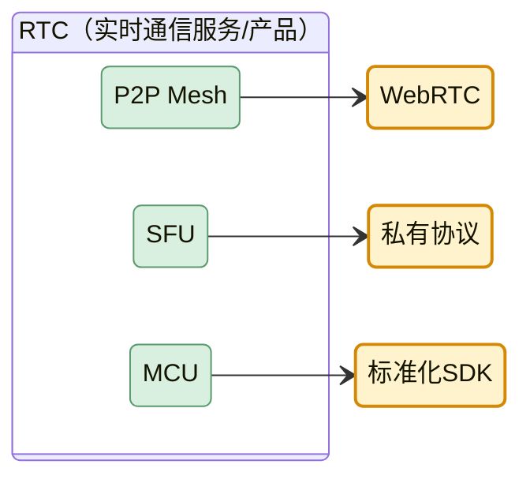
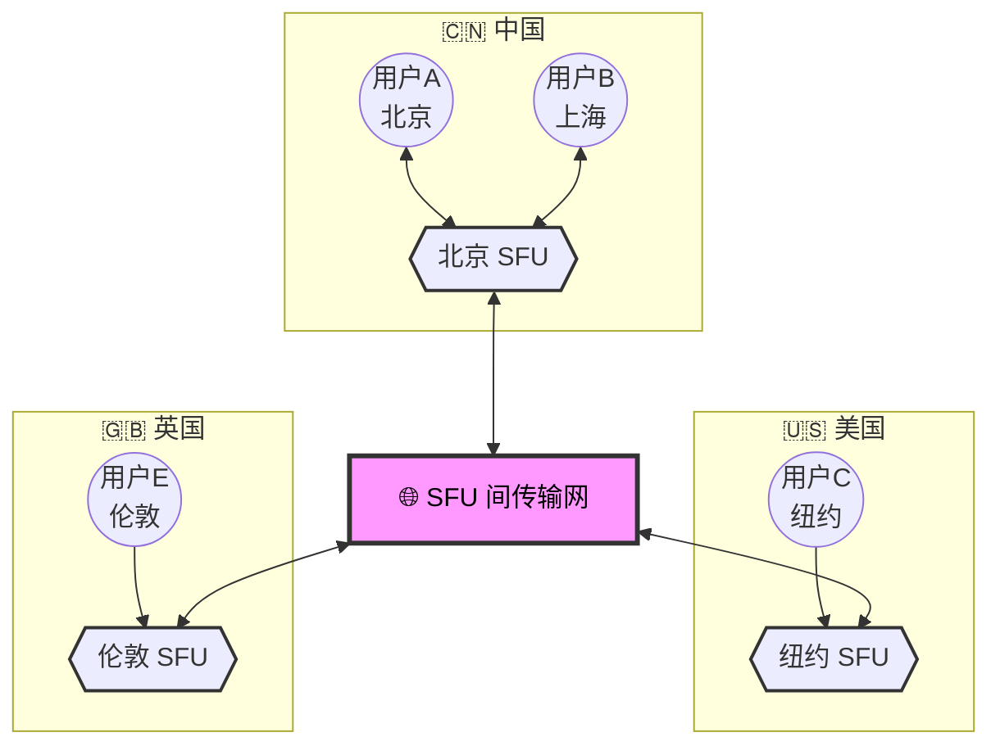

<!-- Copyright © 2026 Techunder (Guanhua Liu) | All Rights Reserved | https://techunder.tech | Email: techunder@163.com -->

RTC 简介

   原创
  发布时间：2026-06-26 | 更新时间：2026-06-26



# 概念

在音视频流媒体通信领域，我们经常听到**RTC**，**P2P**，**WebRTC**这个三个概念。

## RTC

RTC 是 Real-Time Communication 实时通信的统称，指端到端延迟 < 400ms 的双向音视频/数据传输能力。

RTC 是一个完整的解决方案，通常包含：信令、媒体协商、网络传输、编解码、回声消除、降噪、QoS 等十几个模块。

声网 RTC、百度 RTC、腾讯 TRTC、阿里 RTC 都是常见的 RTC 服务商。

## P2P

P2P 全称为 Peer-to-Peer，点对点的网络架构，通信双方直接建立连接，媒体流不经服务器转发。

但NAT/防火墙穿透困难，必须依靠 STUN 做地址探测，甚至只能降级为使用 TURN 中继。

多人通话时，每个客户端都要上传 N-1 路流，4 人以上时可能会卡顿。

## WebRTC

[WebRTC](https://www.w3.org/TR/webrtc/) 全称为 Web Real-Time Communication，是一套开源实时音视频通信技术标准，由谷歌主导推出，浏览器原生支持，不需要安装插件，目前是W3C标准。

## 关系

P2P 只是 RTC 连接方式之一，事实上RTC 服务里的连接架构有好几种演进：

| 架构 | 全称 | 特点 | 适用场景 |
|---|---|---|---|
| **Mesh** | P2P Mesh（网状） | 全员直连，无服务器 | ≤ 4 人小会议 |
| **SFU** | Selective Forwarding Unit | 服务器只转发，不处理 | 主流方案，4-50 人 |
| **MCU** | Multipoint Control Unit | 服务器合流后再下发 | 弱网多，但延迟高 |

现代 RTC 服务**默认都是 SFU 架构**，P2P 仅用于 1v1 通话。

**RTC**，**P2P**，**WebRTC**这个三者的关系为：

# SFU 网络

用户**就近接入** RTC 网络，即连接到地理/网络最近的 SFU 边缘节点（通常 < 50ms），而不同地区的媒体流通过 RTC 服务商的**专用传输网**互转。

这里的"就近接入"，远不止地理就近，实际的接入调度要考虑三个层面：

1. **物理层就近**
- 节点不能只按"城市"划分，要按"运营商+省份+城市"三维定位。
- 一个广东电信用户的最优节点可能不在广州，而在某个 BGP 出口带宽更好的城市。

2. **网络层就近**（最关键）
- BGP Anycast：同一 IP 在多地广播，路由器自动选最近的入口。
- 跨运营商优化：中国电信用户访问挂在联通线路的服务器会绕路，RTC 服务商通常是多线 BGP 或三网接入。

3. **实时层就近**（最根本）
- 节点不是越多越好，要考虑负载和链路质量。
- 调度系统会持续探测每个节点到客户端的 RTT、丢包率、抖动，**动态切换**。

SFU 之间也不是简单转发，通常跑的是**自研私有协议**，不是普通 TCP/UDP/HTTP。

有几个反直觉的认知：

1. **国内出海 RTC 的真正难点不是"全球节点"**
- 大多数 RTC 服务商在 30+ 国家都有边缘节点
- 真正难的是**跨国传输**：中国 ↔ 海外的带宽贵、波动大、政治因素多
- 有些方案是在香港/新加坡做"中转枢纽"，国内用户先到香港 SFU，再到全球

2. **SFU 节点的"覆盖密度"有边际效应**
- 5 个节点覆盖 80% 用户
- 50 个节点只覆盖到 95%
- 再多投入产出比骤降
- 所以通常RTC服务商不会无限制铺节点，而是**优化骨干传输 + 智能调度**

3. **"就近"不等于"最近"**
- 有时候次近的节点反而延迟更低（因为最近那个拥塞了）
- 调度算法要做实时探测，**不能只看静态地理距离**

4. **弱网 70% 丢包仍可通话**
- 这依赖的是 **FEC（前向纠错）**、**ARQ（自动重传）**、**Jitter Buffer 抗抖动**
- 不是光靠"全球节点"就能解决的

**全球节点只是基础设施**，真正的护城河是**调度算法 + 传输优化 + 弱网对抗**
